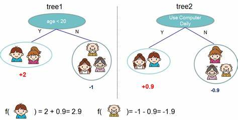
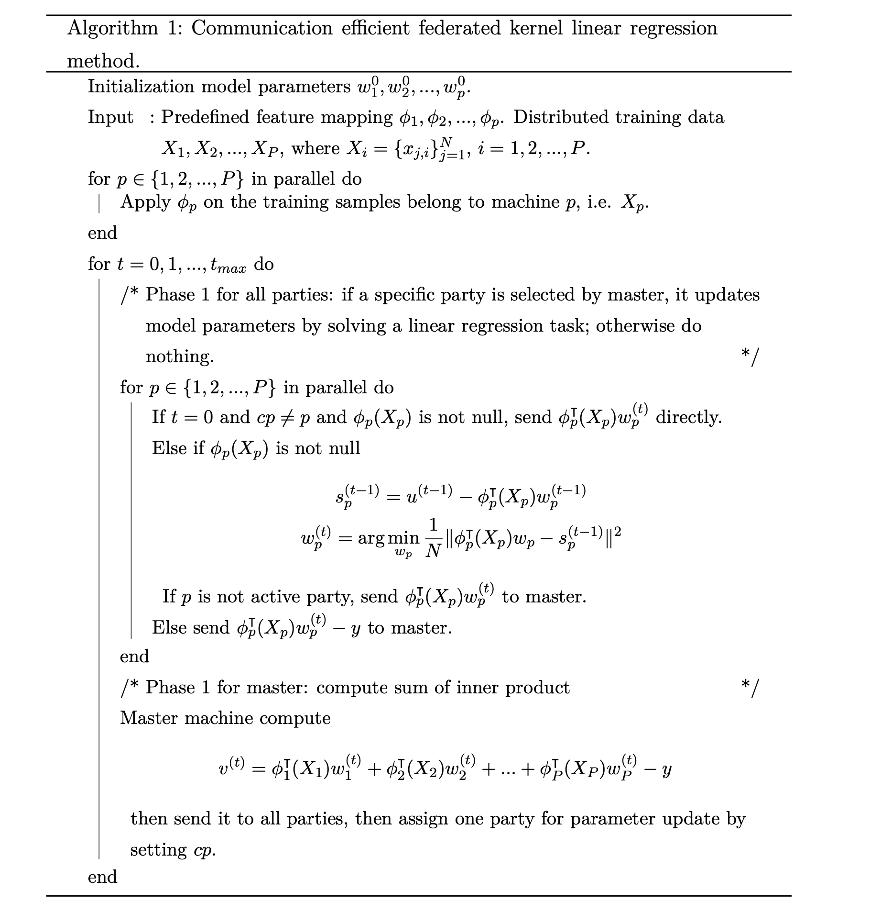

京东科技联邦学习平台(fedlearn)算法手册
============

对于各个算法进行介绍，主要包含算法的基本原理，执行步骤，参数选项和适用性。

## 一、联邦梯度提升树（federatedGB）介绍
federatedGB 算法基于梯度提升决策树的思想，是对XGBOOST方法的改造，其原理是通过多个弱分类器的结果进行加权，再结合决策树得到强分类器－提升树，主要应用于监督学习中。

XGBOOST 基于 CART 树(分类与回归树, Classification and Regression Tree)实现，从名字就可以看出既可以处理分类也可以处理回归问题。CART 能够通过对变量进行划分来不断分裂生成一个二叉树，首先对特征数据排序，然后对排序的特征进行切分，最终的切分点由评估指标确定，分类指标为基尼指数，回归指标是最小平方和，找到切分点后生成左右子树。

和 XGBoost 相同，SecureBoost 的导数不是一阶的，而是二阶的；还对正则项进行了改进，在对叶子个数做惩罚的同时加入了权重惩罚。
### 1.1 算法数据流

 #### 1.1.1 训练
> 训练过程分为1个数据初始化和5个phase，
>
>  **数据初始化**: master 将对齐的id，用户选好的特征等发送给各个client，client根据传入的超参数，选定的特征和id等，再结合本地加载的数据，进行model 和 trainData的初始化， 返回是否初始化成功，此处不涉及从client端用户数据外传。
>
>  **phase1**: master 根据初始化情况构造请求，发送给有label的client，client 根据label和predict 计算g(gradient)， h(hessian)，并进行同态加密后返回。首次初始化的 predict值来自于随机生成，同时每次计算gradient和hessian只需要label和predict 两个参数即可,与特征无关。
> 
>  **phase2**: master 收到加密后的梯度数据（即[g]和[h]），转发给所有没有label的client，各个client根据[g]，[h]计算不同特征和阈值分裂对应的左子树[Gl]，[Hl]，返回给服务端，同时，有label的客户端计算本地的特征分裂候选，并选出本地最佳的分裂特征和阈值。
> 
>  **phase3** master将收到的各个client返回的加密的[GL]，[HL]候选发送给有label的客户端，客户端根据 SplitFinding 算法，计算最佳分裂特征和阈值序号<i,k,v>,　其中i是客户端id，k是特征，v是分裂值序号。和本地最佳分裂进行比较，选择最好的作为节点的分裂方式。
> 
>  **phase4**:  master将 <i,k,v> 发送给与i对应的client，该client计算1.分裂候选中取出对应分裂阈值；２.进行分裂，计算左子树样本集合；３.记录节点分裂信息和对应编号，并将左子树样本id和recordId返回。
> 
>  **phase5**：master 将返回的左子树样本id和recordId发送给有label的client，client更新查询树并根据新的左右子树样本进行下一轮迭代。
>
>  **根据上述流程，各个client需要传出数据的步骤有phase1和 phase2，在phase1中，我们传给master的是加密后的梯度数据，且密钥只保存在自己手中， 在phase2 中，各个没有label的client只是根据[g]，[h] 枚举了所有的左子树 [Gl]，[Hl]，并未传出数据。**
> 
>  **注：[ ] 表示同态加密**
 #### 1.1.2 推理
> 推理过程分为2个phase
> **phase1**： master将加密后需要推理的id发送给各个客户端，各个客户端根据id加载数据，同时有label的客户端返回查询树给master
> **phase2**： master根据查询树，从树的根节点开始，确定需要请求的client和recordId，发送给client，client根据recoredId和样本值，计算树的下溯方向，返回给master，不断迭代直到到达叶子节点后，计算score返回给用户。
> 
> **在整个推理过程中，各方的特征数据都在本地计算，用户id在传输过程中也用的是MD5变换后的id，能够保证用户数据的安全性**

###  1.2 安全性

#### 1.2.1 安全保护措施

主要采用同态加密对有label的参与方的label信息进行保护。

#### 1.2.2 支持的场景

- 支持多种部署，包括协调端和任意一方部署在一起或者单独部署均可
### 1.3 应用场景

FederatedGB 主要应用于监督学习中，适用于垂直联邦学习场景，即各个客户端有大量的相同样本，而拥有不同的特征数据。在这一框架下，不存在客户端之间的直接交互，全部通过服务端进行。

FederatedGB 框架中可以加入任意数量的客户端，每个客户端可以拥有部分数据的标签。或适用于某几方拥有丰富的特征数据，而缺少标签数据的场景，在这种情况中，由一方提供标签数据即可进行联合训练，训练中不会传输任何的标签数据，不存在数据泄露的情况。

###  1.4 算法参数
|序号|参数|说明|类型|区间|默认值|
|  ---- | ---- |----|----|----| ------- |
|1|num_boost_round|树的个数|数值型|（1, 100）|50|
|2|first_round_pred|初始化预测值|数值型|（0.0, 1.0）|0.0|
|3|maximize|是否对评估函数最大化|字符型|{"true", "false"}|"true"|
|4|rowsample|样本抽样比例，抽取进入模型训练的样本比例|数值型|（0.1, 1.0）|1.0|
|5|colsample|列抽样比例，特征随机采样的比例|数值型|（0.1, 1.0）|1.0|
|6|early_stopping_round|早停轮数|数值型|（1, 20）|10|
|7|min_child_weight|子节点中最小的样本权重和，如果一个叶子节点的样本权重和小于min_child_weight则停止拆分|数值型|（1, 10）|1|
|8|min_sample_split|分裂一个内部节点(非叶子节点)需要的最小样本数|数值型|（1, 20）|10|
|9|lambda|L2正则化权重项，值越大，模型越保守|数值型|（1, 20）|1|
|10|gamma|叶节点进行分支所需的损失减少的最小值，值越大，模型越保守|数值型|（0,1）|0|
|11|scale_pos_weight|平衡正权和负权|数值型|（0, 1）|1|
|12|num_bin|特征分桶个数|数值型|（33, 50）|33|
|13|eval_metric|模型评估指标，目前包括mse，mae，rmse，mape四种|字符型|{"mse", "mae", "rmse", "mape"}|"rmse"|
|14|max_depth|树的深度，合理的树深可以防止过拟合|数值型|(5, 20)|7|
|15|eta|learning_rate，为了防止过拟合，更新过程中用到的收缩步长|数值型|(0.01, 1)|0.3|
|16|loss|loss计算方法，目前支持分类（"reg:logistic"，"binary:logistic"）和回归（"reg:square","count:poisson"）任务|字符型|{"reg:logistic","reg:square","count:poisson","binary:logistic"}|"count:poisson"|
|17|cat_features|目前尚未生效，先传1|字符型|{}|" "|
|18|randomized_response_probability|差分隐私随机性|数值型|(0, 1)|0|
|19|differential_privacy_parameter|差分隐私程度|数值型|(0, 1)|0|

## 2. Faderated Learning Random Forest

Random forest algorithm belongs to bagging method. Its principle is to construct multiple decision trees by randomly selecting features and samples.

As the basic atom of random forest, decision tree is a very simple algorithm, which is not only interpretable, but also in line with human intuitive thinking. This is a supervised learning algorithm based on if-then-else rules. The random forest model is composed of many decision trees. Each decision tree is completed independently by randomly sampled samples and features, and there is no explicit correlation between them. Therefore, for a random forest with N decision trees, it is necessary to synthesize N decision results to give the final prediction.

###  2.1 Algorithm Process

The difference between the federated learning version of the random forest algorithm and the ordinary random forest is that the homologous encryption is used to ensure data transmission security between multiple parties, while the split point is selected in the form of local sorting of features and percentile partition to ensure that the distribution of features is not leaked.Other processes are consistent with ordinary random forest.

 #### 2.1.1 Train Process

> The training process is divided into one data initialization and five phases
>
> **Data initialization**: The coordinator sends the parameters selected by the user to each client. Each client initializes the model and traindata according to the incoming super parameters, samples, feature samples and sample IDs, combined with the locally loaded data. The active party additionally initializes the random forest tree model. Finally, each client returns whether the initialization is successful.
>
> **phase1**: The coordinator initiated a new round of training. If the active client executes phase 1 for the first time, encrypt the label and send the encrypted label and public key to the coordinator. The active client calculates the current index according to the label and the node where the sample falls, and judges whether the node to be split meets the early end condition (according to the maximum depth of the tree and the minimum number of split samples of the node). If so, it is set as a leaf node. Otherwise, it returns the sample IDs of the node.
>
> **phase2**: The coordinator updates the current metrics according to the results returned by active client, and sends the sample IDs of the node to all parties; If it is executed for the first time, send the obtained encrypted label and public key to the passive party, and the passive party saves the encrypted label and public key. Each client sorts the data corresponding to the sample IDs according to each feature. After sorting, it divides the bucket, calculates the homomorphic encrypted label mean of each bucket, and finally returns the result of sorting each feature.
>
> **phase3**: The coordinator combines the results returned by Phase2 and sends them to the active party. The active client traverses all features and all segmentation points, calculates the best splitting point, and judges whether it can be split. If not, it is set as a leaf node. If it can, it sends the splitting point information to each client.
>
> **phase4**:  The coordinator sends the information to each client. Each client calculates the corresponding splitting threshold according to the incoming splitting information, stores the threshold locally, and returns the splitting feature ID, splitting percentage, and samples of left and right child nodes after splitting.
>
> **phase5**：The coordinator sends the information to the active party, the active party writes the splitting information in the tree model, generates the left and right child nodes, and sets the child nodes as the nodes to be split.

 #### 2.1.2 Inference Process

> The inference process is divided into two phases
> **phase1**：The coordinator sends the IDs to be inferred to each client. Each client loads data according to the IDs. At the same time, the client returns the predicted direction of the data at the corresponding node according to the node corresponding to the local model, and returns it to the coordinator. The active party obtains the value of the leaf node additionally.
> **phase2**：The coordinator transmits the prediction direction returned by the passive party to the active party, and the active party obtains the final prediction result according to the value that finally falls on the leaf node.

###  2.2 Security

#### 2.2.1 Safety Protection Measures

Homomorphic encryption is used to protect the label information with the active party, and the private key is saved in the active party.

#### 2.2.2 Support Scenarios

Support multiple deployments, including the deployment of the coordination end and either party together or separately.

### 2.3 Application Environment

Federated learning random forest algorithm is suitable for vertical federated learning scenarios, that is, each client has a large number of the same samples and different characteristic data. In this framework, there is no direct interaction between clients, all through the coordination end.
Federated random forest algorithm can support supervised numerical regression and binary classification problems. Due to homomorphic encryption, the multi classification problem cannot be realized under the premise of equal security.
The federated random forest algorithm is applicable to multiple parties. Any number of clients can be added and owned by one party. In this case, one party can provide label data for joint training. In the training, no characteristic data will be transmitted, and only the encrypted label will be transmitted, without data leakage.

### 2.4 Parameter

| No.  | Parameter          | Illustration                  | Type    | Interval                                                     | Default value     |
| ---- | ------------------ | ----------------------------- | ------- | ------------------------------------------------------------ | ----------------- |
| 1    | numTrees           | Number of trees               | Integer | [1, 100]                                                     | 10                |
| 2    | maxDepth           | Max size of tree depth        | Integer | [3, 10]                                                      | 15                |
| 3    | maxTreeSamples     | Max size of data sample       | Integer | (0, 100000]                                                  | 1000              |
| 4    | maxSampledFeatures | Max size of feature sample    | Integer | [1, 100]                                                     | 25                |
| 5    | maxSampledRatio    | Feature sampled ratio         | Float   | (0, 1]                                                       | 0.6               |
| 6    | numPercentiles     | Number of feature percentiles | Integer | [3, 100]                                                     | 30                |
| 7    | minSamplesSplit    | Min size of samples split     | Integer | [1, 100]                                                     | 10                |
| 8    | eval_metric        | Metrics                       | String  | {"RMSE", "AUC", "MAPE", "KS", "F1", "ACC", "RECALL","RAE","R2","RRSE","MSE", "PRECISION", "CONFUSION", "ROCCURVE", "KSCURVE", "TPR", "FPR"}, | {"RMSE"}          |
| 9    | randomSeed         | Random seed                   | Integer | [1, 1000]                                                    | 666               |
| 10   | encryptionType     | Encryption type               | String  | {"Paillier", "IterativeAffine"}                              | "IterativeAffine" |
| 11   | cat_features       | Will be used in the future    | String  | {}                                                           | ""                |

####   Parameter adjustment direction:

During modeling, it is recommended to select the appropriate number of samples and feature sampling proportion of each tree according to the data set, and correct the fitting effect of the whole model by setting a certain numTrees (such as 10, 15, 30, etc.), maxDepth (such as 3, 5, 7, etc.), numPercentiles (such as 10, 30, 100, etc.) and minSamplesSplit (such as30, 50 ,100, etc.).

## 3. Distributed Federated Learning Random Forest

The distributed federated learning random forest is transformed on the basis of the federated learning random forest. Due to the independence of each tree of the random forest, the tree of the random forest is divided into N tasks through distribution and handed over to each worker for execution. Each task only needs to load the data required by the corresponding tree, not the full amount of data, which reduces the memory consumption of a single machine and gets rid of the limitation of the insufficient memory of a single machine on the sample size of training data.

###  3.1 Algorithm Process

The difference between the distributed version and the standard version is that in the initialization stage, N models need to be initialized according to the number of trees selected by parameters, and only the sampled data is loaded respectively. In the training process, after receiving the coordinator's request, the request is divided into n tasks according to each tree and handed over to each worker for parallel execution. After the task is executed, the model is stored locally, and the returned results are combined and returned to the coordinator. Other processes are basically consistent with the standard version.

###  3.2 Security

The distributed version can be understood as splitting a client into one manager and multiple workers. The interaction between manager and worker is carried out within the party and will not be disclosed to the coordinator or other clients. The security between each client and the coordinator is consistent with the standard version.

### 3.3 Application Environment

The distributed federal random forest solves the limitation of training data sample size caused by insufficient memory of a single machine, and is suitable for the scenario of multiple small memory machines. Others are consistent with the standard version.

### 3.4 Parameter

The distributed version is consistent with standard version.

## 4. Federated Learning Kernel

There is a type of support vector machine algorithm (SVM) in machine learning, which is commonly used in binary classification. Its basic model is a linear classifier with the largest interval defined in the feature space. The largest interval makes it different from perceptrons. The learning strategy of SVM is to maximize the interval, which can be formalized as a problem of solving convex quadratic programming, which is also equivalent to the problem of minimizing the regularized hinge loss function. The learning algorithm of SVM is the optimal algorithm for solving convex quadratic programming. However, the original SVM can't actually handle the linearly separable problem, and it needs to cooperate with the kernel function transformation to handle the non-linearly separable scene.
Kernel methods, such as support vector machines and kernel principal component analysis, are based on the properties of regenerated kernel Hilbert Spaces. Taking support vector machines and kernel principal component analysis as an example, for a semi-positive definite kernel function K(commonly known as Mercer's kernel), we can find that there is an eigenmap φ that projects a sample into a regenerated Hilbert space.
$$
k(x, y) =< φ(x), φ(y) >
$$
Since φ is a high-dimensional mapping, this brings obstacles to the use of kernel transforms in practical problems. Therefore, we adopted an approximate kernel transformation method to make the kernel mapping practical.

The approximate kernel transformation is to randomly generate a transformation matrix according to a certain probability, W = [w1, w2 , ... , wm], wi ∈Rd , where m represents the number of basis functions, and d represents the original feature dimension. And a bias vector b∈Rd.

Taking the RBF kernel function used in the current system as an example, for the sample x∈Rd, its approximate kernel mapping can be expressed as
$$
φ(x) = [z1(x), z2(x), ..., zm(x)], zi(x) = \sqrt{2γ} cos(wi⊤x + bi) (1)
$$
The γ parameter needs to be manually set, and each element in  wi conforms to the Gaussian distribution N(0, 1), and each element in bi conforms to the uniform distribution [0, 2π], achieving the effect of "lower dimension and higher dimension". So as to turn the SVM into a substantial non-linear classifier through the technique of kernel function transformation, so as to support non-linear separable complex scenes. At the same time, because each sample is processed by random matrix multiplication, random vector addition and cosine transformation, these data transformation methods can fully protect the original data.

### 4.1 Process of algorithm 

The following is the flow chart of the algorithm. 

### 4.2 Algorithmic Security

#### 4.2.1 Safety protection measures

In the federated kernel algorithm, each sample is processed by random matrix multiplication, random vector addition and cosine transformation. These data transformation methods can fully protect the original data without the need for additional encryption of data using homomorphic encryption.

However, in the process of federated modeling, the client needs to return the local predicted value to the coordinator. If the current client has no characteristics and only contains the target value, since the target value is not transformed, the current client has data leakage At this time, the coordinator and the current client need to be on the same side to ensure data security.

#### 4.2.2 Supported Scenarios

The Federal kernel method supports multi-party modeling. Each client owns part of the characteristic data, and one party owns the label data. All participants have equal status and can initiate tasks to jointly complete the model construction. However, when the client that owns the label side only has the label side, the client and the coordinator need to be deployed together to ensure data security.

The federated kernel algorithm currently supports regression, binary classification and multi-classification problems.

### 4.3 Application scenarios

Kernel function transformation is a widely used operator in machine learning. In the classic SVM algorithm, by mapping low-dimensional features to high-dimensional kernel space, the classification model of original linear inseparable data samples can be realized. For regression problems, the current The algorithm has not proven to be comparable to other algorithms in performance. But for most classification problems, especially two classification problems, there will be very good results. The kernel algorithm currently mainly supports two-class and multi-class model training and prediction tasks. Before use, the data needs to be normalized and preprocessed.
**Data size**
The kernel algorithm model converts the sample features and encrypts them through the method of kernel transformation, and we have implemented the Batch processing function in the algorithm. At present, under the memory limit of about 4G, it can efficiently support the number of samples of 50W and the number of samples of about 200 dimensions. Feature dimensions, if the machine configuration supports it, a single machine is expected to support up to one million training data of about one thousand feature dimensions. The training of larger data sets will be supported in subsequent distributed versions.
**Time overhead**
Thanks to the mathematical optimization of the nuclear transformation, the operating efficiency of the nuclear algorithm is very high. The time cost of the algorithm is mainly related to the following parameters: the dimensionality of the kernel space and the number of samples. At present, the test results on the existing 44W sample 118-dimensional feature data set, the training convergence time can be controlled within 40 minutes, which is very suitable for quickly completing new tasks or benchmarks on the data set and quickly cooperating with Feature engineering for iteration.
**Performance Value**
The kernel algorithm is not only fast and robust during training, but the reasoning process does not need to change the participants multiple times according to the depth. Therefore, the performance of the training set and the performance of the test set are small, and the error range that may be generated during inference is relatively good expectations.

### 4.4 Algorithm parameters

Currently, the following parameters are provided for adjustment:
• batch size: This parameter is a parameter reserved by the program for processing large batches of data. By setting the batch size, the algorithm will process the data in batches each time. Offline experiments show that the batch size has a certain impact on accuracy. Of course, the increase in accuracy brought about by this is limited when it reaches a certain level. Set a larger value by default.
• scale: This parameter corresponds to γ in formula 1. This value has a large relationship with model performance and needs to be adjusted according to the data set;
• mapdim: Corresponding to the kernel mapping dimension space, which is m in formula 1;
• maxIter: the number of communications for model training.

具体参数如下：

| id   |      parameter      | Parameter Description |       Type       | Parameter interval | default value |
| ---- | :-----------------: | :----------------------------------------------------------: | :--------------: | :----------------------------------------------------------: | :-----------: |
| 1    |      batchSize      |                          batch Size                          |     numeric      |                       （1000,5000000）                       |     10000     |
| 2    |        scale        |               Kernel transform scale parameter               |     numeric      |                        (0.000001, 1)                         |      0.1      |
| 3    |        seed         |                         random sedd                          |     numeric      |                           (0,2000)                           |      100      |
| 4    |       mapdim        |                   Kernel mapping dimension                   |     numeric      |                           (0,1000)                           |      400      |
| 5    |       maxIter       |                Number of training iterations                 |     numeric      |                          (10,1000)                           |      100      |
| 6    |     metricType      | Model evaluation indicators, currently including RMSE,AUC, etc | Enumeration type |                   ["RMSE","AUC","ACC",...]                   | ["TRAINLOSS"] |
| 7    |      numClass       |                     Number of categories                     |     numeric      |                         type number                          |       1       |
| 8    | differentialPrivacy |                Differential degree of privacy                |     numeric      |                            (0, 1)                            |       0       |

## 五、 联邦垂直线性/垂直逻辑回归算法说明书

由于联邦垂直线性回归和垂直逻辑回归在算法步骤上较为相似，因此我们将这两个算法一起介绍。垂直线性回归在损失函数上采用普通线性回归的损失函数，但在纵向联邦学习的场景下，计算梯度时需要多方传输各自的中间结果并在Master汇总。为了保证数据安全，我们使用Paillier对传出的数据进行加密。
垂直逻辑回归在训练步骤上和线性回归一致。唯一的不同在于损失函数的计算：由于逻辑回归的损失函数(Logistic Funcion)为非线性函数无法进行半同态加密，我们对损失函数及其导数使用线性分段函数进行了一阶近似。

### 5.1、算法流程	

> #### 5.1.1 训练
>
> 训练过程分为1个数据初始化和4个phase，
>
> > **数据初始化**: master 将对齐的id，用户选好的特征等发送给各个client，client根据传入的超参数，选定的特征和id等，再结合本地加载的数据，进行model 权重weight和 trainData的初始化， 返回是否初始化成功，此处不涉及从client端用户数据外传。
>
> > **phase1**: master 根据初始化情况构造请求，发送给无label的client，client 根据初始化的权重weight计算本地的predictA(记为PA)和lossA(记为LA)，并进行同态加密后返回。
> >
> > **phase2**: master 收到加密后的梯度数据（即[LA]和[PA]），转发给有label的client，有label的client计算本地的predictB(记为PB)和lossB(记为LB)，并将master转发的各无label的LA和PA进行汇总，得到损失函数梯度的中间结果D[PA+PB-label]及loss的中间结果[Diff]，返回给master。
> >
> > **phase3** master 根据收到的loss的中间结果进行解密计算模型的训练精度，将梯度的中间结果转发给各client，各client计算本地的[gradients]，引入正则化防止过拟合，通过随机数和差分隐私来提高数据安全。
> >
> > **phase4**:  master将收到的各client的加密梯度进行汇总，并对汇总的梯度进行更新，然后将更新后的梯度返回给各client。各client去除phase3加的随机数，更新本地模型的weight并进行下一次迭代。
> >
> > 
>
> > **根据上述流程，各个client需要传出数据的步骤有phase1、phase2和phase3，在phase1和phase2中，无label的client传给master的是加密后的loss和predict，在phase3 中，各client将加密的gradients。**
> >
> > **注：[ ] 表示同态加密**
>
> #### 5.1.2 推理
>
> 推理过程分为1个phase
>
> >**phase1**： master将加密后需要推理的id发送给各个客户端，各个客户端根据id加载数据和已完成训练的模型，根据weight计算推理数据在本地的推理结果，并返回给master，master将各client的推理结果进行汇总，得最终的推理结果。
> >
> >**在整个推理过程中，各方的特征数据都在本地计算，用户id在传输过程中也用的是MD5变换后的id，能够保证用户数据的安全性**

## 5.2 安全性

联邦垂直线性/逻辑回归算法目前支持PaillierJava一种同态加密方式。
当前算法框架私钥在协调端，因此需要协调端诚信。同时意味着当客户端仅有y值时，会导致该客户端数据存在安全隐患，需要该客户端与协调端在一起，以保证数据安全性。

## 5.3 算法支持场景

​		主要应用于监督学习中，适用于垂直联邦学习场景，即各个客户端有大量的相同样本，而拥有不同的特征数据。在这一框架下，不存在客户端之间的直接交互，全部通过服务端进行。

​		这两个算法目前只支持两个客户端的计算，每个客户端拥有部分特征数据，其中一方拥有标签数据，两方地位平等，均可发起任务共同完成模型的构建。其中逻辑回归算法由于只实现了Logistic Function梯度的计算，仅支持二分类的场景。

## 5.4 算法参数

| id   | 参数 | 参数说明 | 类型 | 参数区间 |  默认值  |
| ---- | :-------------------------------------------------------: | :----------------------------------------------------------: | :-------------------------------------------------------: | :----------------------------------------------------------: | :------: |
| 1    |                          minLoss                          |              终止loss，当loss小于该值时停止训练              |                          数值型                           |                         （0.1, 100）                         |   0.1    |
| 2    |                            eta                            |                学习率，用于控制梯度下降的速度                |                          数值型                           |                          (0.01, 1)                           |   0.1    |
| 3    |                        metricType                         |           模型评估指标，目前包括MAE，MSE，RMSE三种           |                          枚举型                           |                     ["RMSE","MAE","MSE"]                     | ["RMSE"] |
| 4    |                         optimizer                         |                          优化器类型                          |                          枚举型                           |                         ["batchGD"]                          | batchGD  |
| 5    |                         batchSize                         |                          batch大小                           |                          数值型                           |                         (100-10000)                          |   1000   |
| 6    |                         maxEpoch                          |                           迭代次数                           |                          数值型                           |                        （100-10000）                         |   300    |
| 7    |                      regularization                       |                          正则化类型                          |                          枚举型                           |                         ["L1","L2"]                          |   "L1"   |
| 8    |                          lambda                           |                          正则化参数                          |                          数值型                           |                            (0,1)                             |  0.001   |
| 9    |                    differentialPrivacy                    |                         差分隐私程度                         |                          数值型                           |                            (0, 1)                            |    0     |

## 六、混合线性回归算法

混合联邦线性回归算法。本方法是传统纵向联邦线性回归的扩展，除了支持纵向数据集的训练之外，还**支持横纵混合数据集直接作为输入进行训练**，并通过联合训练横向纵向数据集来**提升模型精度**，同时使得**原来ID无法对齐的数据可以进行推理**。 在原理上，本方法借鉴了多视角学习的思路：通过把不同数据集上相同ID所对应的样本看
做是一个用户的在不同视角下的描述， 假设观测到的所有数据即来自不同参与方各自视角的组合，对数据集中出现的视角组合统一建模并进行联合训练。为了增加训练效率，本算法实现了**基于BFGS的二阶优化方法**，并针对联邦学习对其进行了分布式改造。

### 6.1 算法流程

### 6.2 安全性

在通信网络结构上，出于安全性和公平性考虑， 我们采用**去中心化**架构，即在本算法中，所有运算均由所有参与方进行计算，不依赖可信第三方。需要指出的是，在算法中，我们从参与方中随机选出了一个Master， 这个Master可以是参与方中的任何一个，同时也不要求此方是可信的。Master和其他参与方仅仅在计算任务上有所区别：Master做的工作包括在同态加密下的聚合和己方数据的处理，而非Master节点只负责处理本参与方的数据。

在安全性上，本方法针对**半诚实模型**是安全的。为了保护计算过程中的安全性，我们实现了基于**分布式秘钥生成和阈值解密的Pailliar算法**。需要指出的是，在当前版本并未完全实现分布式秘钥生成部分，仍需要Master(协调端)作为可信第三方并生成各个参与方的公钥和私钥；后续会加入分布式秘钥生成模块, 则不需要Master是可信的。

### 6.3、算法支持场景

本方法主要应用于数据集存在较多ID无法对齐的场景；对于单独的横向或者纵向的数据输入也同样适用。多方参与训练时，必须有**至少一个**参与方含有训练数据的标签，否则无法进行训练。

### 6.4、算法参数选择

| id   | 参数 | 参数说明 | 类型 | 参数区间 |  默认值  |
| ---- | :-------------------------------------------------------: | :----------------------------------------------------------: | :-------------------------------------------------------: | :----------------------------------------------------------: | :------: |
| 1    |                          minLoss                          |              终止loss，当loss小于该值时停止训练              |                          数值型                           |                         （0.1, 100）                         |   0.1    |
| 2    |                            eta                            |                学习率，用于控制梯度下降的速度                |                          数值型                           |                          (0.01, 1)                           |   0.1    |
| 3    |                        metricType                         |           模型评估指标，目前包括MAE，MSE，RMSE三种           |                          枚举型                           |                     ["RMSE","MAE","MSE"]                     | ["RMSE"] |
| 6    |                         maxEpoch                          |                           迭代次数                           |                          数值型                           |                        （100-10000）                         |   300    |
| 7    |                      regularization                       |                          正则化类型                          |                          枚举型                           |                         ["L1","L2"]                          |   "L1"   |
| 8    |                          lambda                           |                          正则化参数                          |                          数值型                           |                            (0,1)                             |  0.001   |

## Federated MixGBoost

MixGBoost is an extended algorithm of FederatedGB. MixGBoost is not only suitable for vertical data scenarios, but also for horizontal data scenarios and data scenarios composed of horizontal and vertical data. Users do not need to judge whether to apply horizontal or vertical learning algorithms based on experience, nor do they need to perform strict horizontal or vertical filtering of data. In this way, the cost of data preprocessing is saved, and the data of each participant is also fully utilized.

## 7.1 Algorithm Details

### 7.1.2 Training

Compared with federatedGB, MixGBoost accepts the distribution of label data in multiple parties and the repeated existence of labels, so it adds a global gradient update step. When calculating the best features of node splitting, two methods of horizontal and vertical learning are combined, and two split candidates, horizontal and vertical, are calculated for the divided data, and finally a splitting decision is made.

In MixGBoost, the training process of each tree includes the following steps:

1. Global gradient update among participants.
2. Tree growth. The split of each tree node goes through three steps:
    (1) Calculating horizontal spliting candidate
    (2) Calculating vertical spliting candidate
    (3) Split decision
3. After a tree has grown, update the sample prediction value and the training metrics, and then continue the training of the next tree.

### 7.1.3 Model Storage and Inference

After the training is completed, the storage and use of MixGBoost is also different from that of FederatedGB. In FederatedGB, the complete tree structures are stored on the active participant, and the split information of different nodes is stored on its corresponding participant. Before the inference starts, the active participant sends the tree structure back to the server, and the server presides over the inference process and asks the participant where the current node is located. Conversely, MixGBoost stores the tree structures separately on multiple participants, and each participant saves substructures of the boosted trees and the node split information it owns. Before the inference starts, the tree substructures from participants are gathered on the server to reconstruct the complete tree structures, and the server also presides the inference process.

### 7.2 Security

MixGBoost is safe against the **semi-honest model**. In the training process, MixGBoost uses homomorphic encryption to encrypt the gradient update values, and the coordinator will receive the encrypted data from each participants. To prevent the participants from colluding with the coordinator, the coordinator cannot be deployed with any participant.

After the training is completed, the tree structures are stored separately on multiple participants, and the information of each node is saved according to the participant where its split feature is located. In order to prevent a participant from approximately inferring the label values of other participants through the weight of leaf nodes, MixGBoost requires that any participant without label data cannot save a complete tree path. If all intermediate node split information on a path is stored on a certain client, then the final leaf node weight of the path will be randomly stored on another participant with label data.

### 7.3 Supporting scenarios

MixGBoost is suitable for data scenarios composed of various degrees of horizontal and vertical overlapping data. In the extreme case where the proportion of overlapping data is almost zero, MixGBoost can also ensure that the process of joint training is not interrupted, and output a complete usable model. The same applies to complete horizontal or vertical data inputs.
The labels of the training samples exist in at least one participant, otherwise the sample will be regarded as an invalid training sample. 

### 7.4 Parameter Description

| id   |      parameter      | Parameter Description |       Type       | Parameter interval | default value |
|  ---- | ---- |----|----|----| ------- |
|1|trainingEpoch|Number of training rounds|Numeric|（1, 5）|1|
|2|maxTreeNum|Maximum number of trees|Numeric|（1, 100）|30|
|3|verticalFeatureSampling|Random feature selection ratio for calculating vertical splitting candidate|Numeric|（0.0, 1.0）|0.8|
|4|horizontalFeaturesRatio|Random feature selection ratio for calculating horizontal splitting candidate|Numeric|（0.0, 1.0）|0.8|
|5|needVerticalSplitRatio|The lowest proportion of common samples using only the vertical splitting candidate|Numeric|（0, 1）|0.98|
|6|maxBinNum|Number of feature buckets|Numeric|（32, 50）|32|
|7|earlyStoppingRound|Number of early stop rounds|Numeric|（1, 20）|10|
|8|minSampleSplit|The minimum number of samples required to split an internal node (non-leaf node)|Numeric|（1, 20）|10|
|9|lambda|L2 regularization weight term, the larger the value, the more conservative the model|Numeric|（1, 20）|1|
|10|gamma|The minimum value of the loss reduction required by a node to branch, the larger the value, the more conservative the model|Numeric|（0,1）|0|
|11|eta|In order to prevent over-fitting in the learning tree, the shrinkage step used in the update process|Numeric|(0.01, 1)|0.3|
|12|numClass|Number of multi-class task categories|Numeric|（1, 1000）|1|
|13|evalMetric|Model evaluation indicators, currently including MSE, MAE, RMSE and MAPE|Enumeration type|{"mse", "mae", "rmse", "mape"}|"rmse"|
|14|maxDepth|Maximum tree depth, reasonable tree depth can prevent overfitting|Numeric|(5, 20)|7|
|16|loss|Loss calculation method, currently supports classification（"reg:logistic"，"binary:logistic"）and regression（"reg:square"）tasks|Enumeration type|{"reg:logistic","reg:square","binary:logistic"}|"reg:square"|
|17|catFeatures|Marking discrete features, not yet supported|String|{}|" "|
|18|bitLength|Ciphertext length|Numeric|{512, 1024})|1024|

