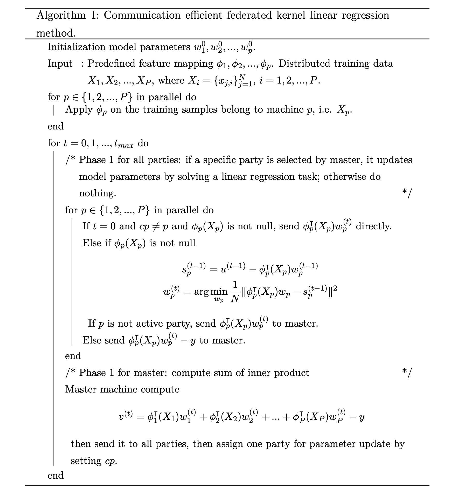

京东科技联邦学习平台(fedlearn)算法手册
============

对于各个算法进行介绍，主要包含算法的基本原理，执行步骤，参数选项和适用性。

## 一、联邦梯度提升树（federatedGB）介绍
federatedGB 算法基于梯度提升决策树的思想，是对XGBOOST方法的改造，其原理是通过多个弱分类器的结果进行加权，再结合决策树得到强分类器－提升树，主要应用于监督学习中。

XGBOOST 基于 CART 树(分类与回归树, Classification and Regression Tree)实现，从名字就可以看出既可以处理分类也可以处理回归问题。CART 能够通过对变量进行划分来不断分裂生成一个二叉树，首先对特征数据排序，然后对排序的特征进行切分，最终的切分点由评估指标确定，分类指标为基尼指数，回归指标是最小平方和，找到切分点后生成左右子树。

和 XGBoost 相同，SecureBoost 的导数不是一阶的，而是二阶的；还对正则项进行了改进，在对叶子个数做惩罚的同时加入了权重惩罚。
### 1.1 算法数据流

 #### 1.1.1 训练
> 训练过程分为1个数据初始化和5个phase，
>
>  **数据初始化**: master 将对齐的id，用户选好的特征等发送给各个client，client根据传入的超参数，选定的特征和id等，再结合本地加载的数据，进行model 和 trainData的初始化， 返回是否初始化成功，此处不涉及从client端用户数据外传。
>
>  **phase1**: master 根据初始化情况构造请求，发送给有label的client，client 根据label和predict 计算g(gradient)， h(hessian)，并进行同态加密后返回。首次初始化的 predict值来自于随机生成，同时每次计算gradient和hessian只需要label和predict 两个参数即可,与特征无关。
> 
>  **phase2**: master 收到加密后的梯度数据（即[g]和[h]），转发给所有没有label的client，各个client根据[g]，[h]计算不同特征和阈值分裂对应的左子树[Gl]，[Hl]，返回给服务端，同时，有label的客户端计算本地的特征分裂候选，并选出本地最佳的分裂特征和阈值。
> 
>  **phase3** master将收到的各个client返回的加密的[GL]，[HL]候选发送给有label的客户端，客户端根据 SplitFinding 算法，计算最佳分裂特征和阈值序号<i,k,v>,　其中i是客户端id，k是特征，v是分裂值序号。和本地最佳分裂进行比较，选择最好的作为节点的分裂方式。
> 
>  **phase4**:  master将 <i,k,v> 发送给与i对应的client，该client计算1.分裂候选中取出对应分裂阈值；２.进行分裂，计算左子树样本集合；３.记录节点分裂信息和对应编号，并将左子树样本id和recordId返回。
> 
>  **phase5**：master 将返回的左子树样本id和recordId发送给有label的client，client更新查询树并根据新的左右子树样本进行下一轮迭代。
>
>  **根据上述流程，各个client需要传出数据的步骤有phase1和 phase2，在phase1中，我们传给master的是加密后的梯度数据，且密钥只保存在自己手中， 在phase2 中，各个没有label的client只是根据[g]，[h] 枚举了所有的左子树 [Gl]，[Hl]，并未传出数据。**
> 
>  **注：[ ] 表示同态加密**
 #### 1.1.2 推理
> 推理过程分为2个phase
> **phase1**： master将加密后需要推理的id发送给各个客户端，各个客户端根据id加载数据，同时有label的客户端返回查询树给master
> **phase2**： master根据查询树，从树的根节点开始，确定需要请求的client和recordId，发送给client，client根据recoredId和样本值，计算树的下溯方向，返回给master，不断迭代直到到达叶子节点后，计算score返回给用户。
> 
> **在整个推理过程中，各方的特征数据都在本地计算，用户id在传输过程中也用的是MD5变换后的id，能够保证用户数据的安全性**

###  1.2 安全性

#### 1.2.1 安全保护措施

主要采用同态加密对有label的参与方的label信息进行保护。

#### 1.2.2 支持的场景

- 支持多种部署，包括协调端和任意一方部署在一起或者单独部署均可
### 1.3 应用场景

FederatedGB 主要应用于监督学习中，适用于垂直联邦学习场景，即各个客户端有大量的相同样本，而拥有不同的特征数据。在这一框架下，不存在客户端之间的直接交互，全部通过服务端进行。

FederatedGB 框架中可以加入任意数量的客户端，每个客户端可以拥有部分数据的标签。或适用于某几方拥有丰富的特征数据，而缺少标签数据的场景，在这种情况中，由一方提供标签数据即可进行联合训练，训练中不会传输任何的标签数据，不存在数据泄露的情况。

###  1.4 算法参数
|序号|参数|说明|类型|区间|默认值|
|  ---- | ---- |----|----|----| ------- |
|1|num_boost_round|树的个数|数值型|（1, 100）|50|
|2|first_round_pred|初始化预测值|数值型|（0.0, 1.0）|0.0|
|3|maximize|是否对评估函数最大化|字符型|{"true", "false"}|"true"|
|4|rowsample|样本抽样比例，抽取进入模型训练的样本比例|数值型|（0.1, 1.0）|1.0|
|5|colsample|列抽样比例，特征随机采样的比例|数值型|（0.1, 1.0）|1.0|
|6|early_stopping_round|早停轮数|数值型|（1, 20）|10|
|7|min_child_weight|子节点中最小的样本权重和，如果一个叶子节点的样本权重和小于min_child_weight则停止拆分|数值型|（1, 10）|1|
|8|min_sample_split|分裂一个内部节点(非叶子节点)需要的最小样本数|数值型|（1, 20）|10|
|9|lambda|L2正则化权重项，值越大，模型越保守|数值型|（1, 20）|1|
|10|gamma|叶节点进行分支所需的损失减少的最小值，值越大，模型越保守|数值型|（0,1）|0|
|11|scale_pos_weight|平衡正权和负权|数值型|（0, 1）|1|
|12|num_bin|特征分桶个数|数值型|（33, 50）|33|
|13|eval_metric|模型评估指标，目前包括mse，mae，rmse，mape四种|字符型|{"mse", "mae", "rmse", "mape"}|"rmse"|
|14|max_depth|树的深度，合理的树深可以防止过拟合|数值型|(5, 20)|7|
|15|eta|learning_rate，为了防止过拟合，更新过程中用到的收缩步长|数值型|(0.01, 1)|0.3|
|16|loss|loss计算方法，目前支持分类（"reg:logistic"，"binary:logistic"）和回归（"reg:square","count:poisson"）任务|字符型|{"reg:logistic","reg:square","count:poisson","binary:logistic"}|"count:poisson"|
|17|cat_features|目前尚未生效，先传1|字符型|{}|" "|
|18|randomized_response_probability|差分隐私随机性|数值型|(0, 1)|0|
|19|differential_privacy_parameter|差分隐私程度|数值型|(0, 1)|0|

## 二、 联邦随机森林

随机森林算法属于集成学习中的Bagging方法，其原理是通过随机选择特征和样本的方式，构建多棵决策树的方法完成决策。

作为随机森林基础原子的决策树是一种很简单的算法，不仅解释性强，也符合人类的直观思维。这是一种基于if-then-else规则的有监督学习算法，下图展示了一个决策树的例子。

 

 

随机森林模型由很多决策树构成的，每棵决策树都由随机采样的样本和特征独立完成，互相之间没有显式的关联。因此，有N棵决策树的随机森林，实际上需要综合N个决策结果给出最终的预测，这个综合往往是通过集成Bagging的方式实现的。比如，当我们进行分类任务时，新的输入样本进入，森林中的每一棵决策树分别进行判断和分类，每个决策树会得到一个自己的分类结果，决策树的分类结果中哪一个分类最多（Majority），那么随机森林就会把这个结果当做最终的结果；如果是回归问题的话，随机森林最后会选择每棵决策树的Mean Value作为最终预测值。

###  2.1 算法流程

联邦版本的随机森林算法相比单机实现的区别在于，采用了同态加密保证多参与方之间数据传输安全性，同时通过特征的本地排序+Percentile划分的形式选取分裂点保证特征的分布不会泄漏。其他流程和单机版本随机森林基本一致。

 #### 2.1.1 训练

> 训练过程分为1个数据初始化和5个phase，
>
> **数据初始化**: 协调方初始化随机森林树结构，并将用户选择的参数等发送给各个client，client根据传入的超参数，样本和特征采样和id等，再结合本地加载的数据，进行model 和 trainData的初始化， 返回是否初始化成功，此处不涉及从client端用户数据外传。
>
> **phase1**: 如果是主动方client首次执行phase1，将label进行加密，并将加密后的label和publickey发送给协调方。如果不是首次执行，协调方获取当前待分裂节点，获取待分裂节点包含的样本id发送给client，主动方client 根据label和样本落在的节点，计算当前指标并返回。
>
> **phase2**: 根据client回传的结果更新当前指标；判断待分裂节点是否满足提前结束条件（根据树的最大深度和节点的最小分裂样本数），如果满足则设为叶子结点，否则，发送节点的样本id到client；将获取的加密后的label发送到client。client将样本id对应数据按每个特征分别进行排序，排序后进行分桶，计算每个桶的同态加密后的label均值，最后将每个特征排序分桶后的结果返回。
>
> **phase3**: 协调方将client方phase2返回的结果合并，发送到主动方。主动方client遍历所有的特征及所有的分割点，计算最佳分裂点，并返回。
>
> **phase4**:  协调方根据client方phase3返回的结果，判断是否可以分裂，如果不可以则设为叶子结点，如果可以，将分裂点信息发送给每个client方。client方根据传入的分裂信息，计算出对应的分裂阈值，并将阈值存在本地，并返回其他分裂信息。
>
> **phase5**：协调方的树模型写入分裂信息，并对生成左右子节点，将子节点置为待分裂节点。

 #### 2.1.2 推理

> 推理过程分为2个phase
> **phase1**： 协调方将需要推理的id发送给各个client，各个client根据id加载数据，同时client根据本地模型对应的节点，返回数据在对应节点的预测方向及叶子结点的值。
> **phase2**： 协调方根据client返回的预测方向和最终落在的叶子结点值，得到最终的预测结果。

###  2.2 安全性

#### 2.2.1 安全保护措施

主要采用同态加密对有主动方的label信息进行保护，私钥保存在主动方。

#### 2.2.2 支持的场景

需将协调端和主动方部署在一起，防止被动方和协调端合谋，根据协调端全局变量中的模型和被动方特征推出主动方的label区间。其他情况下协调端和任意一方部署在一起或着单独部署均可以。后续修改为将模型在主动方维护后，可以任意方式部署。

### 2.3 应用场景

联邦随机森林算法适用于垂直联邦学习场景，即各个客户端有大量的相同样本，而拥有不同的特征数据。在这一框架下，不存在客户端之间的直接交互，全部通过协调端进行。

联邦随机森林算法目前可以支持有监督的数值回归和二分类问题。多分类问题由于同态加密的原因，暂时无法在同等安全性的前提下实现。

联邦随机森林算法适用于多方，可以加入任意数量的客户端，某一方拥有，在这种情况中，由一方提供标签数据即可进行联合训练，训练中不会传输任何的标签数据，不存在数据泄露的情况。

### 2.4 算法参数

| 序号 | 参数               | 说明                   | 类型   | 区间                                                         | 默认值            |
| ---- | ------------------ | ---------------------- | ------ | ------------------------------------------------------------ | ----------------- |
| 1    | numTrees           | 树的个数               | 数值型 | [1, 100]                                                     | 10                |
| 2    | maxDepth           | 最大深度               | 数值型 | [3, 10]                                                      | 15                |
| 3    | maxTreeSamples     | 一棵树最多sample样本数 | 数值型 | (0, 100000]                                                  | 1000              |
| 4    | maxSampledFeatures | 最多sample特征数       | 数值型 | [1, 100]                                                     | 25                |
| 5    | maxSampledRatio    | 特征采样比例           | 数值型 | (0, 1]                                                       | 0.6               |
| 6    | numPercentiles     | 分位点个数             | 数值型 | [3, 100]                                                     | 30                |
| 7    | minSamplesSplit    | 最少分裂样本数         | 数值型 | [1, 100]                                                     | 10                |
| 8    | eval_metric        | 验证指标               | 字符型 | {"RMSE", "AUC", "MAPE", "KS", "F1", "ACC", "RECALL","RAE","R2","RRSE","MSE", "PRECISION", "CONFUSION", "ROCCURVE", "KSCURVE", "TPR", "FPR"}, | {"RMSE"}          |
| 9    | randomSeed         | 随机种子               | 数值型 | [1, 1000]                                                    | 666               |
| 10   | encryptionType     | 加密方式               | 字符型 | {"Paillier", "IterativeAffine"}                              | "IterativeAffine" |
| 11   | cat_features       | 目前尚未生效           | 字符型 | {}                                                           | ""                |

####   整体调参方向：

由于随机森林的特性（bagging，即有多个独立的模型进行预测，最后以某种方式进行聚合操作，如平均，中位数等），在建模的时候建议根据数据集选择合适的每棵树样本采样数和特征采样比例，并通过设置一定量的树的个数（如10，15，100等），树的深度（如3，5，7等），分位点个数（10，30，100等），最少分裂样本数（30，50，100等）对整个模型的拟合效果进行校正，防止欠拟合或过拟合。

## 三、 分布式版联邦随机森林

分布式版联邦随机森林在联邦随机森林的基础上进行了分布式改造。由于随机森林的每棵树具有独立性，因此，通过分布式把随机森林的树拆分成n个任务，交给各个worker分别执行，每个任务只需加载对应树需要的数据，而不是全量数据，降低了单台机器的内存消耗，摆脱了单台机器内存不足对训练数据样本量的限制。

###  3.1 算法流程
分布式版本联邦随机森林算法相比标准版联邦版随机森林实现的区别在于：在初始化阶段，需要根据参数选择的树的棵数，初始化n个模型，分别只加载采样后的数据。在训练过程中，收到协调方请求后，将请求按每棵树进行拆分，分解为n个任务，交给各个worker并行执行，任务执行完后，将模型存储到manager本地，并将返回结果合并后，传回协调方。其他流程和标准版联邦随机森林基本一致。

###  3.2 安全性
分布式版联邦随机森林可以理解为将某一方的client拆分为一个manager和多个worker。manager和worker之间的交互均在该方的内部进行，不会泄漏给协调方或者其他client方。各个client方与协调方之间的安全性与标准版联邦随机森林一致。

### 3.3 应用场景
分布式版联邦随机森林解决了单台机器内存不足导致的训练数据样本量的限制，适用于多台小内存机器的场景。其他与标准版联邦随机森林一致。

### 3.4 算法参数
目前分布式版联邦随机森林加密方式只支持Paillier，其他与标准版联邦随机森林一致。

## 四、 联邦核算法

机器学习中有一类支持向量机算法 (SVM)，常见于二分类建模的场景中，它 的基本模型是定义在特征空间上的间隔最大的线性分类器，间隔最大使它有别于 感知机。SVM 的的学习策略就是间隔最大化，可形式化为一个求解凸二次规划的 问题，也等价于正则化的合页损失函数的最小化问题。SVM 的的学习算法就是求 解凸二次规划的最优化算法。然而原始的 SVM 其实无法处理线性可分的问题，需 要配合核函数变换处理非线性可分的场景。
核方法，以支持向量机和核主分量分析为例，是建立在再生核希尔伯特空间特 性的基础上的。以支持向量机和核主分量分析为例，对于一个半正定核函数 K(通 常也被称为 Mercer 核)，我们可以找到有一个特征映射 φ, 将一个样本投影到再生 希尔伯特空间中
$$
k(x, y) =< φ(x), φ(y) >
$$
由于 φ 是一个高维映射，这给核变换在实际问题中的使用带来了障碍。因此，我们采用了近似核变换的方法使得核映射实用化。 

近似核变换是通过按照某种概率随机生成一个变换矩阵
$$
W = [w1,w2,...,wm],wi ∈ Rd
$$
其中m代表基函数个数，d代表原始特征维数。以及一个偏置向量b∈R .
以目前系统中采用的 RBF 核函数为例，对于样本 x ∈ Rd, 它的近似核映射可 以表示为
$$
φ(x) = [z1(x), z2(x), ..., zm(x)], zi(x) = 􏰇2γ cos(wi⊤x + bi) (1)
$$
其中 γ 参数需要人工设置，wi 中每个元素符合高斯分布 N (0, 1)， bi 中每个元素 符合均匀分布 [0, 2π]，达成实质上的“低维升高维”的效果，从而通过核函数变换 的技巧将 SVM 变为实质上的非线性分类器，从而支持非线性可分的复杂场景。同 时，由于每个样本采用了随机矩阵乘法、加随机向量和余弦变换对样本做了处理， 这些数据变换方法能充分起到保护原始数据的作用。
### 4.2 算法流程
以下是系统算法的流程. 
### 4.2 安全性
#### 4.2.1 安全保护措施

​		联邦核算法由于每个样本采用了随机矩阵乘法、加随机向量和余弦变换对样本做了处理，这些数据变换方法能充分起到保护原始数据的作用，无需采用同态加密对数据进行额外加密。

​        但是在联邦建模过程中，客户端需要将本地的预测值回传至协调端，若当前客户端无特征，仅包含目标值情况下，由于未对目标值做变换，当前客户端存在数据泄露的安全隐患，此时需要协调端与当前客户端在同一方以保证数据安全性。

#### 4.2.2 支持的场景

​		联邦核算法支持多方建模，每个客户端拥有部分特征数据，其中一方拥有标签数据，各参与方地位平等，均可发起任务共同完成模型的构建。但是当拥有label方的客户端仅有label时，需要改客户端与协调端不是在一起以保证数据安全性。

​         联邦核算法目前支持回归、二分类和多分类问题。

### 4.3 算法应用场景

核函数变换是机器学习中被广泛使用的一种算子，在经典 SVM 算法中通过将低维特征映射到高维核空间，可以实现原始线性不可分数据样本的分类模型，对于回归问题，目前的算法尚未证明可以有比肩其他算法的性能;但对于大多数的分类问题，尤其时二分类问题会有非常不错的效果。核算法目前主要支持二分类和多分类模型训练和预测任务。在使用前, 数据需先进行归一化预处理。
**数据规模**
核算法模型通过核变换的方法转换样本特征并加密，并且我们已经在算法中实现了 Batch 批处理功能，目前在 4G 左右的内存限制的情况下可以高效支持 50W 级别的样本数量和 200 维左右的特征维度，机器配置支持的话，单台机器预计最多 可以支持百万级别一千左右特征维度的训练数据，更大的数据集的训练会在后续的分布式版本中给予支持。
**时间开销**
得益于核变换的数学优化，核算法的运行效率非常高。算法的时间开销主要和以下几个参数相关:核空间的维度，样本数量。目前在已有的 44W 样本 118 维 特征数据集上的测试结果，训练收敛时间可以控制在 40 分钟以内，非常适合迅速 完成新任务或者数据集上的benchmark 并快速配合 Feature engineering 进行迭代。
**性能数值**
核算法在训练时不仅速度快，鲁棒性强，同时推理过程也不需要按照深度多次转变参与方，因此训练集性能和测试集性能差别较小，推理时可能产生的误差范围有比较好的预期。

### 4.4 算法参数
目前提供了如下几个参数供调整:
• batch size: 该参数是程序为处理大批量数据所预留的一个参数。通过设置
batch size 大小，算法每次会将数据分批处理。线下实验表明，batch size 大小 对精度有一定影响。当然大到一定程度后精度因此而带来的提升有限。默认设大一些。
• scale: 这个参数对应的是公式 1 中的 γ。这个值和模型性能关系较大，需要
根据数据集调整;
• mapdim: 对应核映射维度空间，也就是公式 1 中的 m;
• maxIter :模型训练通信次数。

具体参数如下：

| id   | 参数 | 参数说明 | 类型 | 参数区间 |    默认值     |
| ---- | :-------------------------------------------------------: | :----------------------------------------------------------: | :-------------------------------------------------------: | :----------------------------------------------------------: | :-----------: |
| 1    |                         batchSize                         |                           分批大小                           |                          数值型                           |                       （1000,5000000）                       |     10000     |
| 2    |                           scale                           |                        核变换尺度参数                        |                          数值型                           |                        (0.000001, 1)                         |      0.1      |
| 3    |                           seed                            |                            种子点                            |                          数值型                           |                           (0,2000)                           |      100      |
| 4    |                          mapdim                           |                        核函数映射维数                        |                          数值型                           |                           (0,1000)                           |      400      |
| 5    |                          maxIter                          |                         训练迭代次数                         |                          数值型                           |                          (10,1000)                           |      100      |
| 6    |                        metricType                         |               模型评估指标，目前包括RMSE,AUC等               |                          枚举型                           |                   ["RMSE","AUC","ACC",...]                   | ["TRAINLOSS"] |
| 7    |                         numClass                          |                           类别数量                           |                          数值型                           |                           类别数量                           |   2或类别数   |
| 8    |                    differentialPrivacy                    |                         差分隐私程度                         |                          数值型                           |                            (0, 1)                            |       0       |

## 五、 联邦垂直线性/垂直逻辑回归算法说明书

由于联邦垂直线性回归和垂直逻辑回归在算法步骤上较为相似，因此我们将这两个算法一起介绍。垂直线性回归在损失函数上采用普通线性回归的损失函数，但在纵向联邦学习的场景下，计算梯度时需要多方传输各自的中间结果并在Master汇总。为了保证数据安全，我们使用Paillier对传出的数据进行加密。
垂直逻辑回归在训练步骤上和线性回归一致。唯一的不同在于损失函数的计算：由于逻辑回归的损失函数(Logistic Funcion)为非线性函数无法进行半同态加密，我们对损失函数及其导数使用线性分段函数进行了一阶近似。

### 5.1、算法流程	

> #### 5.1.1 训练
>
> 训练过程分为1个数据初始化和4个phase，
>
> > **数据初始化**: master 将对齐的id，用户选好的特征等发送给各个client，client根据传入的超参数，选定的特征和id等，再结合本地加载的数据，进行model 权重weight和 trainData的初始化， 返回是否初始化成功，此处不涉及从client端用户数据外传。
>
> > **phase1**: master 根据初始化情况构造请求，发送给无label的client，client 根据初始化的权重weight计算本地的predictA(记为PA)和lossA(记为LA)，并进行同态加密后返回。
> >
> > **phase2**: master 收到加密后的梯度数据（即[LA]和[PA]），转发给有label的client，有label的client计算本地的predictB(记为PB)和lossB(记为LB)，并将master转发的各无label的LA和PA进行汇总，得到损失函数梯度的中间结果D[PA+PB-label]及loss的中间结果[Diff]，返回给master。
> >
> > **phase3** master 根据收到的loss的中间结果进行解密计算模型的训练精度，将梯度的中间结果转发给各client，各client计算本地的[gradients]，引入正则化防止过拟合，通过随机数和差分隐私来提高数据安全。
> >
> > **phase4**:  master将收到的各client的加密梯度进行汇总，并对汇总的梯度进行更新，然后将更新后的梯度返回给各client。各client去除phase3加的随机数，更新本地模型的weight并进行下一次迭代。
> >
> > 
>
> > **根据上述流程，各个client需要传出数据的步骤有phase1、phase2和phase3，在phase1和phase2中，无label的client传给master的是加密后的loss和predict，在phase3 中，各client将加密的gradients。**
> >
> > **注：[ ] 表示同态加密**
>
> #### 5.1.2 推理
>
> 推理过程分为1个phase
>
> >**phase1**： master将加密后需要推理的id发送给各个客户端，各个客户端根据id加载数据和已完成训练的模型，根据weight计算推理数据在本地的推理结果，并返回给master，master将各client的推理结果进行汇总，得最终的推理结果。
> >
> >**在整个推理过程中，各方的特征数据都在本地计算，用户id在传输过程中也用的是MD5变换后的id，能够保证用户数据的安全性**

## 5.2 安全性

联邦垂直线性/逻辑回归算法目前支持PaillierJava一种同态加密方式。
当前算法框架私钥在协调端，因此需要协调端诚信。同时意味着当客户端仅有y值时，会导致该客户端数据存在安全隐患，需要该客户端与协调端在一起，以保证数据安全性。

## 5.3 算法支持场景

​		主要应用于监督学习中，适用于垂直联邦学习场景，即各个客户端有大量的相同样本，而拥有不同的特征数据。在这一框架下，不存在客户端之间的直接交互，全部通过服务端进行。

​		这两个算法目前只支持两个客户端的计算，每个客户端拥有部分特征数据，其中一方拥有标签数据，两方地位平等，均可发起任务共同完成模型的构建。其中逻辑回归算法由于只实现了Logistic Function梯度的计算，仅支持二分类的场景。

## 5.4 算法参数

| id   | 参数 | 参数说明 | 类型 | 参数区间 |  默认值  |
| ---- | :-------------------------------------------------------: | :----------------------------------------------------------: | :-------------------------------------------------------: | :----------------------------------------------------------: | :------: |
| 1    |                          minLoss                          |              终止loss，当loss小于该值时停止训练              |                          数值型                           |                         （0.1, 100）                         |   0.1    |
| 2    |                            eta                            |                学习率，用于控制梯度下降的速度                |                          数值型                           |                          (0.01, 1)                           |   0.1    |
| 3    |                        metricType                         |           模型评估指标，目前包括MAE，MSE，RMSE三种           |                          枚举型                           |                     ["RMSE","MAE","MSE"]                     | ["RMSE"] |
| 4    |                         optimizer                         |                          优化器类型                          |                          枚举型                           |                         ["batchGD"]                          | batchGD  |
| 5    |                         batchSize                         |                          batch大小                           |                          数值型                           |                         (100-10000)                          |   1000   |
| 6    |                         maxEpoch                          |                           迭代次数                           |                          数值型                           |                        （100-10000）                         |   300    |
| 7    |                      regularization                       |                          正则化类型                          |                          枚举型                           |                         ["L1","L2"]                          |   "L1"   |
| 8    |                          lambda                           |                          正则化参数                          |                          数值型                           |                            (0,1)                             |  0.001   |
| 9    |                    differentialPrivacy                    |                         差分隐私程度                         |                          数值型                           |                            (0, 1)                            |    0     |

## 六、混合线性回归算法

混合联邦线性回归算法。本方法是传统纵向联邦线性回归的扩展，除了支持纵向数据集的训练之外，还**支持横纵混合数据集直接作为输入进行训练**，并通过联合训练横向纵向数据集来**提升模型精度**，同时使得**原来ID无法对齐的数据可以进行推理**。 在原理上，本方法借鉴了多视角学习的思路：通过把不同数据集上相同ID所对应的样本看
做是一个用户的在不同视角下的描述， 假设观测到的所有数据即来自不同参与方各自视角的组合，对数据集中出现的视角组合统一建模并进行联合训练。为了增加训练效率，本算法实现了**基于BFGS的二阶优化方法**，并针对联邦学习对其进行了分布式改造。

### 6.1 算法流程

### 6.2 安全性

在通信网络结构上，出于安全性和公平性考虑， 我们采用**去中心化**架构，即在本算法中，所有运算均由所有参与方进行计算，不依赖可信第三方。需要指出的是，在算法中，我们从参与方中随机选出了一个Master， 这个Master可以是参与方中的任何一个，同时也不要求此方是可信的。Master和其他参与方仅仅在计算任务上有所区别：Master做的工作包括在同态加密下的聚合和己方数据的处理，而非Master节点只负责处理本参与方的数据。

在安全性上，本方法针对**半诚实模型**是安全的。为了保护计算过程中的安全性，我们实现了基于**分布式秘钥生成和阈值解密的Pailliar算法**。需要指出的是，在当前版本并未完全实现分布式秘钥生成部分，仍需要Master(协调端)作为可信第三方并生成各个参与方的公钥和私钥；后续会加入分布式秘钥生成模块, 则不需要Master是可信的。

### 6.3、算法支持场景

本方法主要应用于数据集存在较多ID无法对齐的场景；对于单独的横向或者纵向的数据输入也同样适用。多方参与训练时，必须有**至少一个**参与方含有训练数据的标签，否则无法进行训练。

### 6.4、算法参数选择

| id   | 参数 | 参数说明 | 类型 | 参数区间 |  默认值  |
| ---- | :-------------------------------------------------------: | :----------------------------------------------------------: | :-------------------------------------------------------: | :----------------------------------------------------------: | :------: |
| 1    |                          minLoss                          |              终止loss，当loss小于该值时停止训练              |                          数值型                           |                         （0.1, 100）                         |   0.1    |
| 2    |                            eta                            |                学习率，用于控制梯度下降的速度                |                          数值型                           |                          (0.01, 1)                           |   0.1    |
| 3    |                        metricType                         |           模型评估指标，目前包括MAE，MSE，RMSE三种           |                          枚举型                           |                     ["RMSE","MAE","MSE"]                     | ["RMSE"] |
| 6    |                         maxEpoch                          |                           迭代次数                           |                          数值型                           |                        （100-10000）                         |   300    |
| 7    |                      regularization                       |                          正则化类型                          |                          枚举型                           |                         ["L1","L2"]                          |   "L1"   |
| 8    |                          lambda                           |                          正则化参数                          |                          数值型                           |                            (0,1)                             |  0.001   |