# 京东科技联邦学习系统使用手册

# Fedlearn User Manual

### 目录

一、部署指南

​	1.1 部署环境要求

​	1.2 原生部署

​		1.2.1 服务端部署

​		1.2.2 客户端部署

​		1.2.3 前端部署

​	1.3 Docker部署

二、界面操作手册

​		2.1 系统权限模块

​		2.2 项目管理模块

​			2.2.1 创建任务

​			2.2.2 加入任务

​		2.3 训练管理模块

​		2.4 推理模块

​		2.5 模型应用模块

三、API接口


四、算法参数介绍

​		4.1 FederatedGB

​		4.2 RandomForest

​		4.3 KernelLinearRegression

​        4.4 VerticalLogisticRegression

​        4.5 VerticalLinearRegression

五、常见问题


#### 一、部署指南

##### 	1.1 部署环境要求

###### 	 	1.1.1 硬件要求

​		目前各数据量推荐的配置如下：

|  数据量  |     推荐配置     |
| :------: | :--------------: |
|  1k*10   |  2核CPU，4G内存  |
|  1w*10   |  4核CPU，8G内存  |
|  10w*10  |                  |
| 40w*100  | 16核CPU，64G内存 |
| 100w*100 |                  |
| 200w*50  |                  |
| 400w*50  |                  |

###### 		1.1.2 系统和软件要求

​		目前平台运行依赖的系统环境和软件依赖如下：

| 系统 | Centos7.4 |
| :--: | :-------: |
| 软件 |  JDK1.8   |

###### 		1.1.3 网络要求

- 网速10M 上下行对称；
- 客户端和服务端连通性；

#####   1.2 原生部署

​		主要包括java原生版联邦学习平台的服务端(coordinator)、客户端(client)和前端(fronted)服务。

######    		1.2.1 服务端部署

- **数据初始化**

​      	服务端依赖数据库保存持久化数据，所以需要创建数据库和初始化表结构。我们现有python项目支持数据库和表的初始化工作；

​          依照元数据存储方式的不同，目前支持mysql和sqlite两种方式，其中sqlite为系统安装包自带。

- **下载安装包，修改配置**

​		  以/export/app/目录（对部署目录无特殊要求，用户可根据实际情况完成以下部署工作）为例，具体部署步骤如下：

​		  a. 安装包下载：获取对应版本安装包至/export/app/目录；

​    	  b. 安装包解压并赋予相应文件夹读写权限：

```
	sudo chmod 777 /export/app/*
	sudo unzip fedlearn-coordinator-assembly.zip -d /export/app
```

​    	  c. 修改master配置文件：配置文件存放于fedlearn-coordinator的conf目录，修改master.properties文件的数据源配置，现在支持mysql和sqllite，详情如下；

```
    ## 应用名，与logback.xml 内的app保持一致
    app.name=fedlearn-coordinator
    # 配置服务端口号
    app.port=8092
    # logback 配置文件实际存放路径
    log.settings=conf/logback.xml
    #元数据保存方法,目前支持mysql和sqlite,并设置数据库文件实际存放路径
    db.type=sqlite
    db.driver=org.sqlite.JDBC
    db.url=jdbc:sqlite:conf/fl.db
    db.username=
    db.password=
    # uncomment below 5 lines if use mysqlmvn packag
    # db.type=mysql
    # db.driver=com.mysql.jdbc.Driver
    # db.username=username
    # db.password=password
    # db.url=jdbc:mysql://127.0.0.1:3306/nlp?characterEncoding=utf8&amp;useSSL=false&amp;autoReconnect=true
    #数据传输过程中是否采用http分包传输
    http.split=true
    #数据传输过程中是否采用压缩
    http.zip=true
    #连接池配置
    #池最大连接数
    db.maxPoolSize=20
    #池最小连接数
    db.minIdle=20
    #连接泄露检测
    db.leakDetectionThreshold=60000

    #数据是否上链，默认为false，true时配置jdchain相关信息
    jdchain.available=false
    #连接网关服务IP
    jdchain.gateway_ip=127.0.0.1
    jdchain.gateway_port=31482
    jdchain.gateway_secure=false
    jdchain.user_pubkey=
    jdchain.user_privkey=
    jdchain.user_privpwd=
    jdchain.ledger_address=
    jdchain.contract_address=
    jdchain.data_account_address=
    jdchain.event_account_address=
    jdchain.user_table_address=
    jdchain.task_table_address=
    jdchain.train_table_address=
```

​    	d. 配置服务日志路径，并赋予该路径相应读写权限

```
	sudo mkdir -d /export/log/fedlearn-coordinator
    sudo chmod 777 /export/log/fedlearn-coordinator/*
```

​    	e. 启动服务：启动脚本存放于fedlearn-coordinator的bin目录，根据机器配置修改start.sh中JAVA_MEM_OPTS(因机器不同，JVM会生效两个中的一个)。

```
	cd /export/app/fedlearn-coordinator/bin
	sh start.sh -c master.properties
```

​		   其中-c为master配置文件实际存放目录。

​        f. 查看服务状态：查看当前服务是否成功启动；

```
	ps -ef|grep fedlearn-coordinator
```

​    	g. 停止服务：存放目录同启动脚本。

```
    cd /app/fedlearn-coordinator/bin
    sh stop.sh 
```


###### 	**1.2.2 客户端部署**

​		 每个client一台机器，使用http模式进行master与client交互：

​		 以/export/app/目录（对部署目录无特殊要求，用户可根据实际情况完成以下部署工作）为例，具体部署步骤如下：

   	  a. 安装包下载：获取对应版本安装包至/export/app/目录；
   	  b. 安装包解压缩并赋予相应目录读写权限；

```
	sudo chmod 777 /export/app/*
	sudo unzip fedlearn-client-assembly.zip -d /export/app
```

​    	 c. 修改client配置文件：配置文件存放于fedlearn-client的conf目录，可根据实际情况修改client.properties文件的数据源配置：

```
    # 目前配置文件
    # 应用名，启动脚本会用到，与logback.xml 内的app保持一致
    app.name=fedlearn-client
    # 设置服务启动端口
    app.port=8094
    # 设置日志文件实际存放路径
    log.settings=conf/logback.xml
    # master端地址ip检查，仅允许指定的ip可访问到本客户端的服务,多个ip用逗号分隔
    master.address=10.222.113.150,172.24.84.207,172.25.221.6,172.23.255.4,10.222.115.224

    # 训练数据数据源配置，支持csv、mysql两种方式，支持多数据源配置，多个数据源通过train1、train2、train3...区分(目前只支持train1-train10)
    # train config, 支持多个数据源
    train1.source=csv
    train1.base=/export/Data/federated-learning-client/
    train1.dataset=train1.csv

    # example of second train data
    train2.source=csv
    train2.base=/export/Data/federated-learning-client/
    train2.dataset=train2.csv

    # example of use mysql
    # train3.source=mysql
    # train3.username=root
    # train3.driver=com.mysql.jdbc.Driver
    # train3.password=password
    # train3.url=jdbc:mysql://127.0.0.1:3306/nlp?characterEncoding=utf8&amp;useSSL=false&amp;autoReconnect=true
    # train3.table=user_click

    # 推理数据源配置，支持csv、mysql、http等多种方式，但目前仅支持每次加载一个推理数据文件且需与训练数据相对应方可完成推理，每次修改完配置文件均需重启服务
    # inference config
    inference.data.source=csv
    inference.base=/export/Data/federated-learning-client/
    inference.dataset1=mo17k_test.csv

    # inference.data.source=dubbo
    #dubbo服务地址
    dubbo.url=dubbo://172.25.64.243:8088

    #inference.data.source=http
    http.url = http://10.6.98.118:10004

    # use mysql
    # inference.data.source=mysql
    # inference.username=root
    # inference.password=password
    # inference.url=jdbc:mysql://127.0.0.1:3306/nlp?characterEncoding=utf8&amp;useSSL=false&amp;autoReconnect=true
    # inference.table=user_click

    #是否允许预测训练集中的uid
    inference.allowTrainUid=True
    # 设置模型保存路径
    model.dir=/export/Data/federated-learning-client/model/
    # 设置预测结果文件存放路径
    predict.dir=/export/Data/federated-learning-client/predict/
    
    
    #数据是否上链,默认为false，true时需根据具体情况修改jdchain相关配置信息
    jdchain.available=false
    jdchain.gateway_ip=
    jdchain.gateway_port=31482
    jdchain.gateway_secure=false
    jdchain.user_pubkey=
    jdchain.user_privkey=
    jdchain.user_privpwd=
    jdchain.ledger_address=
    jdchain.contract_address=
    jdchain.data_account_address=
    jdchain.event_account_address=
```

​		其中，

​		①master IP检查：为了保证服务安全性，仅此处添加的master的ip地址可以访问到当前client服务；

​		②训练数据数据源配置：目前支持从csv和mysql两种方式，并可同时配置多个数据源。当数据源类型为csv时，需设置文件存放路径train1.base及数据文件名称train1.dataset；当数据源类型为mysql时，需设置用户名、密码、url及数据表名。

​		③推理数据数据源配置：当前推理数据仅支持加载一个推理数据文件，支持csv、mysql、dubbo和http等多种方式。csv和mysql配置方式同训练数据，指向相应文件即可；dubbo和http需提供相应的url。【注：推理文件和训练文件相对应时，才能完成推理服务，每次修改完配置文件，需重启服务配置文件方可生效】。

​		④是否预测训练集的uid：在推理界面输入训练集中的uid时，可正常推理；

​        d. 配置服务日志路径，并赋予该路径相应读写权限。

```
	sudo mkdir -d /export/log/fedlearn-client
    sudo chmod 777 /export/log/fedlearn-client/*
```

​        e. 启动client服务：启动脚本存放于fedlearn-client的bin目录，根据机器配置修改start.sh中JAVA_MEM_OPTS(因机器不同，JVM会生效两个中的一个)。

```
	cd /export/app/fedlearn-client/bin
	sh start.sh -c client.properties
```

​       其中-c为client配置文件实际存放目录。

​        f. 查看服务状态：查看当前服务是否启动。

```
	ps -ef|grep fedlearn-client
```

​		g. 停止服务：存放目录同启动脚本。

```
    cd /app/fedlearn-client/bin
    sh stop.sh 
```

- **注：修改完master/client的配置文件，均需重启服务方可生效。**

  

###### 1.2.3 前端部署

​		前端为联邦学习平台的可视化界面，便于操作，更好的实现联邦学习模型的训练和推理服务。推荐前端与服务端master部署在同一台机器。以/export/app/（对部署目录无特殊要求，用户可根据实际情况完成以下部署工作）目录为例，详细部署如下：

​		a. 获取安装包：下载对应版本的前端压缩包federated-learning-front.jar；

​		b. 配置服务日志路径，并赋予该路径相应读写权限。

```
	sudo mkdir -d /export/log/federated-learning-front
    sudo chmod 777 /export/log/federated-learning-front/*
```

​		c. 启动前端服务。

```
	cd /export/app
	java -jar federated-learning-front.jar
```

- **注：也可通过nohup起服务，保证服务不会轻易挂掉 【nohup java -jar federated-learning-front.jar >> /export/app/federated-learning-front/front.log 2>&1 & 】**

​		d. 查看服务状态：查看当前服务是否启动。

  ```
	ps -ef|grep federated-learning-front
  ```

  

##### 1.3 Docker部署

​		Docker是一款开源的应用容器引擎。通过Docker可以打包源码以及依赖包到一个可移植到的镜像中。联邦学习平台的随机森林算法，核算法，水平联邦算法通过打包后的Docker镜像部署到服务器中。详细部署步骤如下：

​		a. 安装Docker：可参考Docker官方网站 www.docker.com 中的文档，安装Docker。安装后执行“systemctl start docker”启动Docker。

​		b. 获取联邦学习算法的Docker镜像：下载镜像压缩包federated-learning-grpc-0.1.0.tar；执行“docker load –i federated-learning-grpc-0.1.0.tar”加载压缩包内镜像；执行“docker image ls”查看已有镜像并记录联邦学习算法镜像对应的image_id。

​		c. 在Docker容器中运行联邦学习镜像：执行“docker run -ti -d=true --name federated-learning-grpc -p 8891:8891 （image_id） bash -c "python3 /app/src/main/python/algorithm/server.py -P 8891"”运行镜像并启动grpc服务；

​		d. 关闭镜像：执行“docker container ls –a”查看已有容器并记录对应的container_id，执行“sudo docker stop （container_id）”停止对应容器即可。


####  二、界面操作手册

​	一站式联邦学习操作平台，包含模型在线训练、在线推理与客户端远端推理。

- 客户端与服务端均由可视化控制台操作，包含训练与推理任务的发起，任务详情展示，一键停止/恢复训练等。通过指令式操作控制客户端，服务端全流程不留存数据；
- 服务端：包括同步训练，异步在线推理；
- 多模型选择与参数灵活配置；
- 客户端：在线选择加入推理算法，支持单条 (API) /远端 (CSV) 文件方式进行预测。支持客户端路径方式，本地化读取文件，减少数据网络传输以及交互安全。

##### 2.1 系统权限模块

- 用户权限
  - 超级管理员：系统唯一超级管理员，可创建新企业。
  - 企业管理员：可创建用户并为其分配权限。
  - 普通用户：可创建、加入任务。
- 登录：输入已注册账号和密码，点击【登录】。

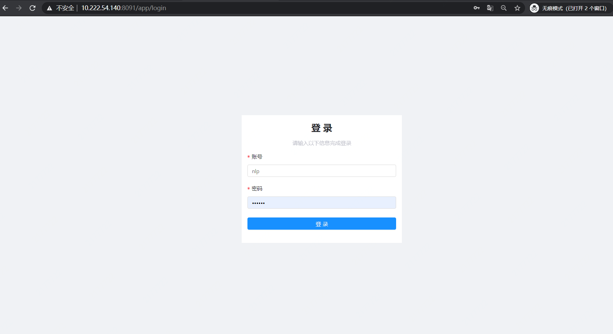

##### 2.2 项目模块

- 发起任务：参与训练的一方作为任务发起方创建任务；
- 加入任务：参加训练的其余客户端加入任务发起方创建的任务；

######   **2.2.1 发起任务**

- **任务-我发起的**

​		在 ”我发起的“ 界面点击任务创建按钮，出现任务创建页面，展示平台线上所有运行的任务，包含任务id、任务名称、具体参与方（包含多方），支持输入任务名称/关键词进行模糊查询。

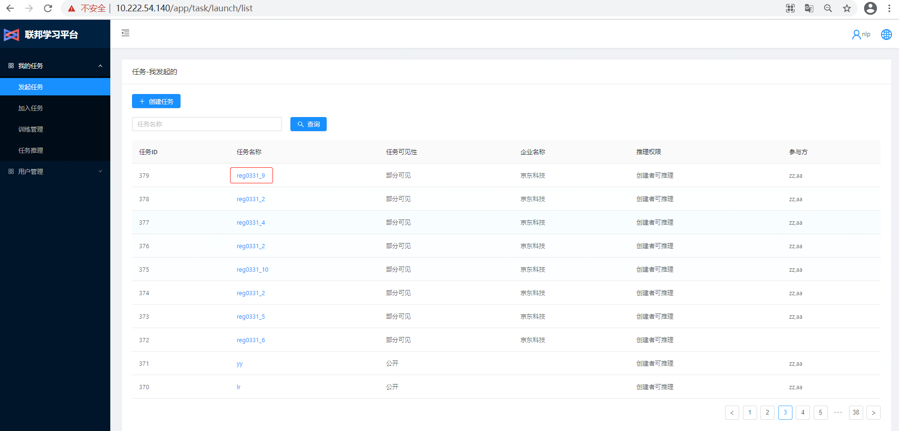

- **任务详情：任务名称**

​		点击【具体任务名称】，查看任务详情信息，页面展示：参与方、客户端地址、特征信息，包括特征描述，特征值、特征类型，以及添加用户。

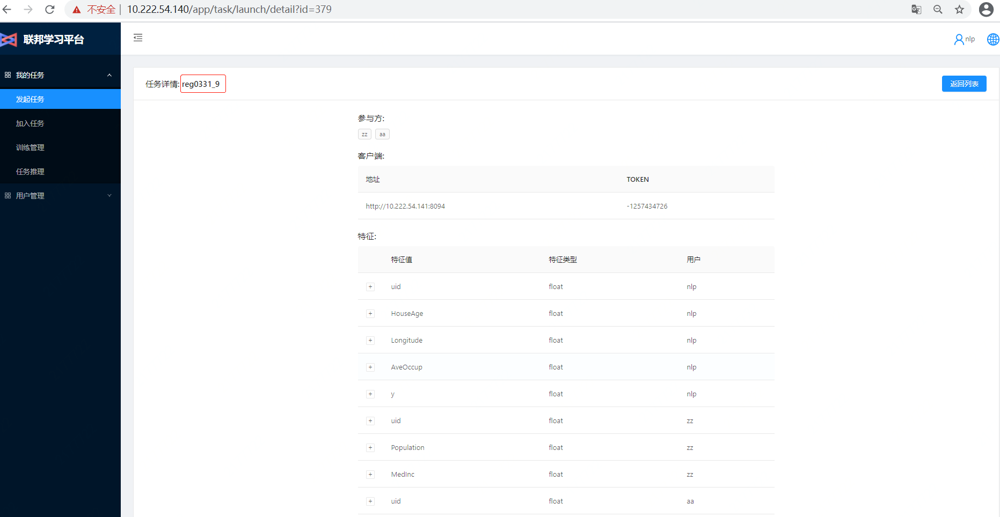

- **创建任务**
- 点击“创建任务”按钮，跳转至任务详情页面；

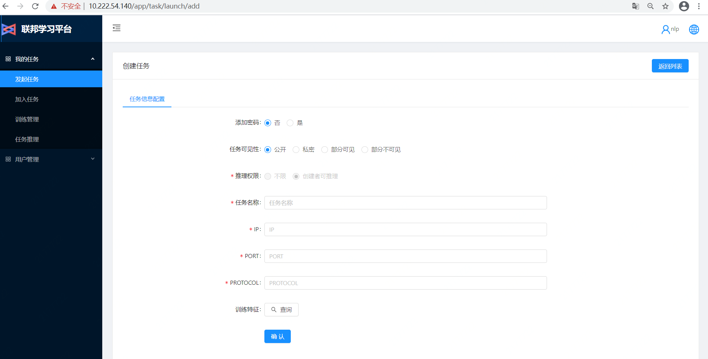

- 任务信息配置：
  - 添加密码：该任务是否有密码；
  - 任务可见性：分公开、私密、部分可见、部分不可见四种情况，每种情况都是企业维度的，如部分可见选择jd，则只有jd的全部用户可见；
  - 推理权限：目前只支持任务创建者可推理；
  - 任务名称：自定义任务名称；
  - ip：参与联邦学习建模的客户端的ip地址；
  - port：上述ip对应的端口号，可在客户端配置文件对port进行自定义，默认为8094；
  - protocol：协议，默认为http
  - 训练特征：点击【查询】按钮，选择【参与任务的数据文件】，即可显示选择数据文件包含的特征；

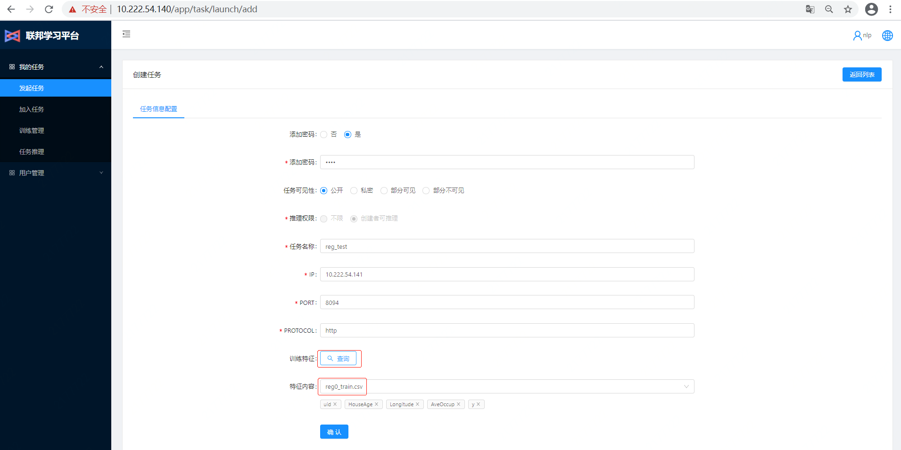

  - 完成训练特征添加之后，点击【确认】按钮，完成任务创建。

###### **2.2.2 加入任务**

​		**切换账户**，登录其他参与训练的客户端。

- **任务-我加入的**

  ​    作为客户端，或者不需要创建训练任务，可直接点击左侧【加入任务】页面，目前平台无权限控制（后续产品化封装会进行独立设计开发），可直接查看平台内所有的任务情况；

  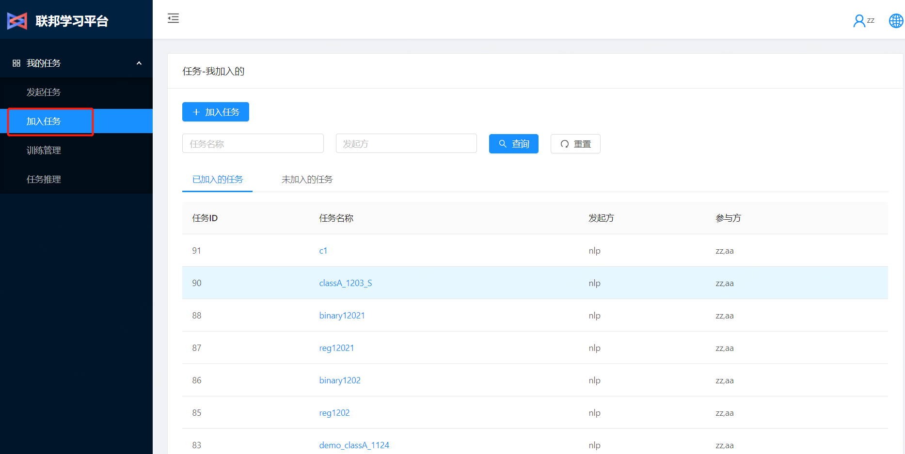         

  ​    管理页面支持关键词，或发起账户ID做模糊查询，快速查找。为提升可读性，当前登录账户ID，分为【已加入的任务】与【未加入的任务】，两个标签页面。

  - 【已加入的任务】
  - 【未加入的任务】可查看所有未加入任务情况，且支持【加入任务】的快捷入口，与上方【加入任务】按钮，起到同等作用；

  可通过【加入任务】或【未加入的任务】-【加入任务】两种方式成功加入任务。

  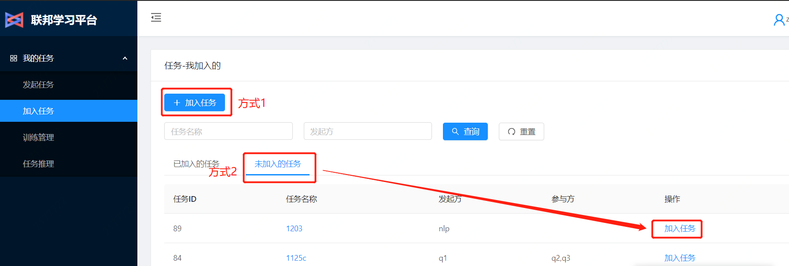

- 加入任务

  - 点击【加入任务】按钮；
  - 跳转任务信息填写页面，下拉表单可快速选择任务名称，输入当前ip等信息，点击【查询】并从下拉列表选择【当前用户参与训练的数据集】，点击【确认】，完成加入；

  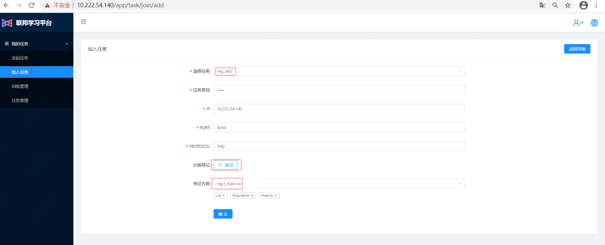

  

  - 点击【任务名称】查看任务详情，可以查看发起方、以及多个参与方，及每个参与方的上传的特征集id预览；

  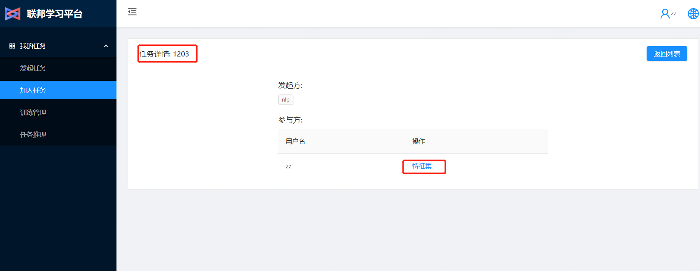

  

  **注：**
  
  - 客户端信息和数据特征信息示例如下：
  
    | 序号 | IP地址  | 端口 | 协议 | 可用数据集       |
    | ---- | ------- | ---- | ---- | ---------------- |
    | 1    | 0.0.0.0 | 8094 | http | 根据下拉列表选取 |
  
  -  **【重要】**目前训练数据支持多数据源加载，推理数据仅支持一个，更换训练数据集时，需更改各客户端配置文件中该训练数据对应的推理文件，如客户端选择train0.csv为训练数据，配置文件的推理数据应指向其对应的test0.csv，并重启客户端服务使得配置文件生效。


##### 2.3 训练管理模块

​		训练管理模块主要是对创建好的任务进行任务训练。

- 训练任务列表
  - 前端可视化，所有任务的训练进度，以及百分比进度条展示完成情况。支持在线停止，和暂停操作。下方做详细文字说明：
  - 停止：即整体停止该训练任务，任务状态做初始化，恢复0%；
  - 暂停：点击【暂停】，记录当前任务状态，支持重启，继续训练；
  
- 训练重启：点击【重启】，启动处于暂停状态的任务，继续训练。
  
- 点击【发起训练】

  - 选择要训练的任务名称。如1203；

    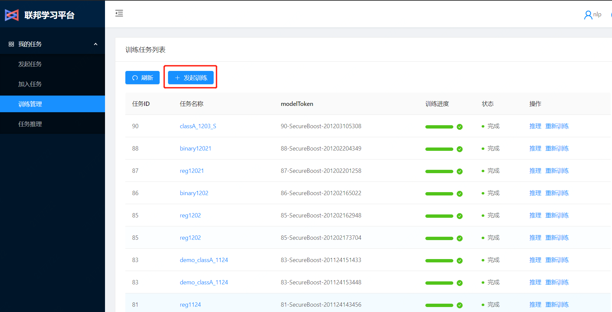

  - 选择要训练的算法名称，目前平台支持FederatedGB，RandomForest等算法，算法参数介绍见第三部分。此处训练以FederatedGB为例。

  - 训练前准备工作：选择ID对齐方式，执行【ID对齐】。

    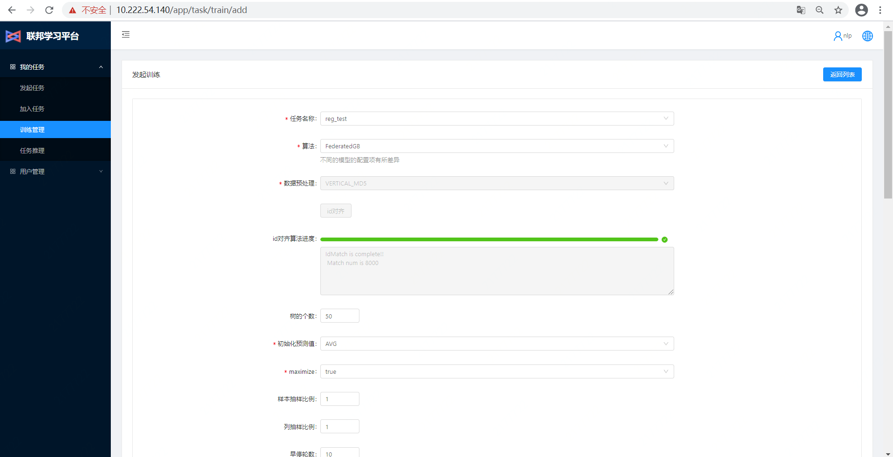
  
  - ID对齐完成后，配置已选择算法的参数组合：
  
    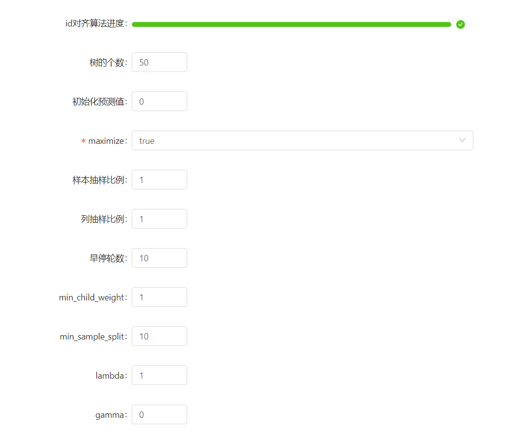
  
    完整参数配置见平台页面；
  
  - 点击【开始训练】，任务状态达到100%，即训练完成；
  
  - 点击【任务名称】，显示任务详情。包含：模型参数，训练参数，训练开始时间，整体进度，以及训练过程中的每层或者每棵树的耗时与数据日志；
  
    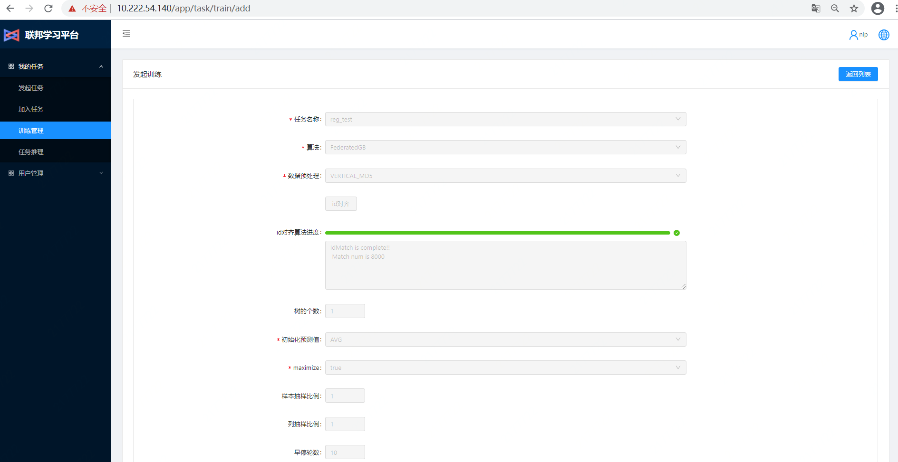
  
  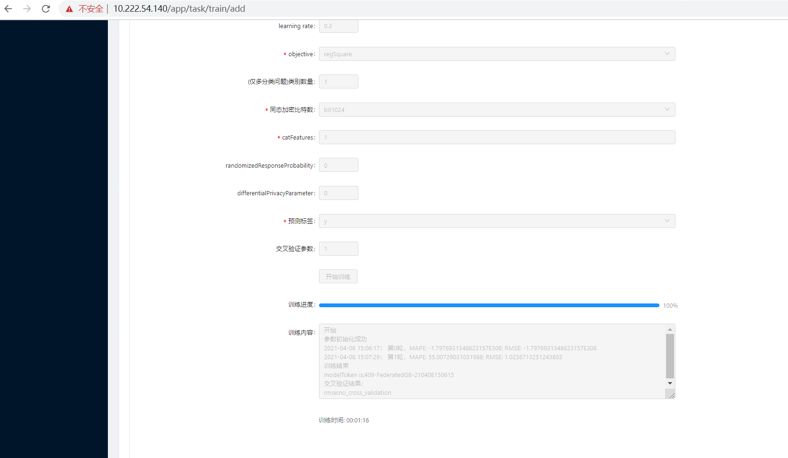
  
- 【重新训练】
  
    考虑到每个训练任务的复用性，提供了重新训练功能，实现同任务名称、同算法、同参数设置的再次训练。
    
    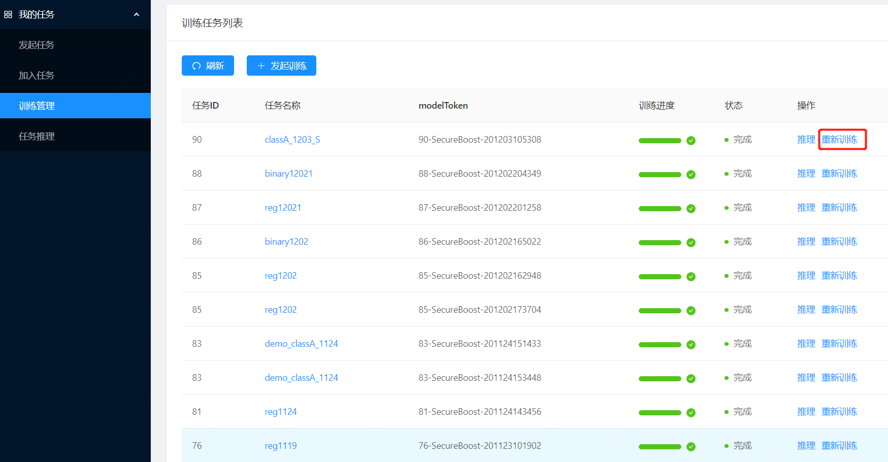
    
    **注：**针对训练100%完成的任务，可以点击【推理】按钮，快捷进入推理环节；

##### 2.4 推理模块

​		方式1：训练任务完成后，可在任务后面点击【推理】按钮，直接进入任务推理页面。

​		方式2：直接点击左侧【任务推理】标签页面，直接选择任务进行推理

- 【手工推理】

  可输入单条或者少量的文本，调用实时API做在线推理，实时返回结果。

  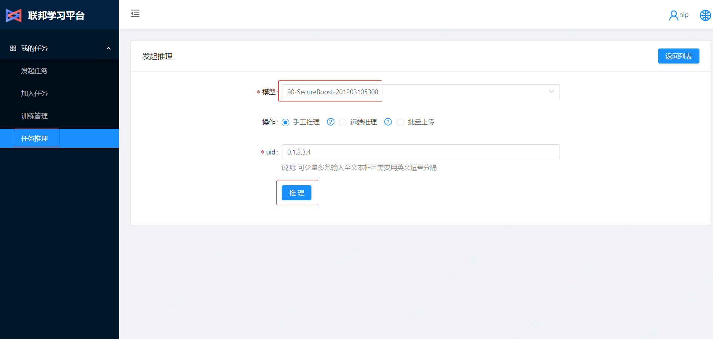

  点击右侧【问号】图标，显示手工推理样例，如图：

  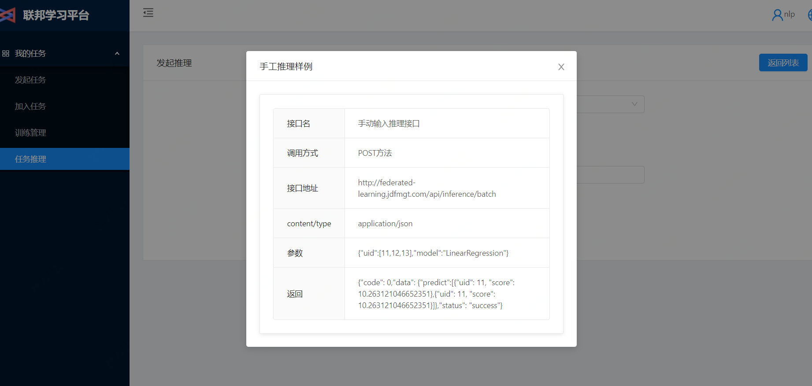

- 【远端推理】

  考虑到客户远端部署，为减少传输成本，以及数据交互安全。用户可输入特征ID的文件路径，平台直接通过客户端读取数据，并将运行结果保存在客户端本地文件中，推理样例可点击【问号】，如图：

  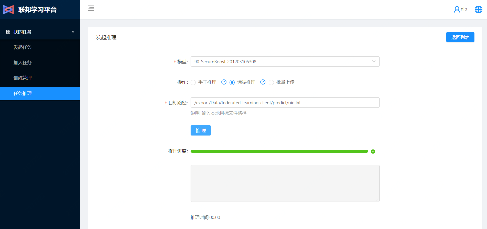

- 【批量上传】

  ​        远端推理需提前将需预测数据上传至相应client的服务器，若用户存在多个需预测文件，操作便捷性有待提高，提供从本地计算机批量上传的接口，点击【批量上传】-【上传文件】，会弹出窗口从本机加载需要预测的uid数据文件，以完成批量推理。
  
  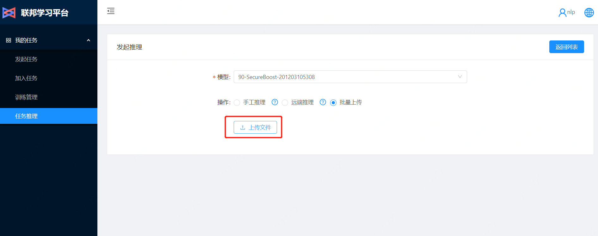


##### 2.5 模型应用

​	模型应用主要是将训练好的模型迁移至任意推理服务环境，使得训练集群和推理集群可以完全隔离开，便于模型的训练和升级。


#### 三、API接口

​																													

#### 四、算法参数介绍

​	京东数科联邦学习目前支持FederatedGB、Randomforest、Kernel等算法，各算法参数介绍如下，具体的算法实现方法见算法白皮书。

##### 4.1 FederatedGB

​	目前FederatedGB支持回归，二分类和多分类任务，可通过设置参数objective(目标函数)及eval_metric(评估指标)，以实现各类型任务，目标函数与任务类型、评估指标的对应关系如下：

| <span style="display:inline-block;width:80px"> Objective</span> | <span style="display:inline-block;width:80px">任务类型</span> | <span style="display:inline-block;width:150px">eval_metric</span> | <span style="display:inline-block;width:230px">备注</span> |
| :----------------------------------------------------------: | :----------------------------------------------------------: | :----------------------------------------------------------: | :--------------------------------------------------------: |
|                       binary:logistic                        |                            二分类                            |                     AUC、ACC、F1、Recall                     |                   训练数据的label为0或1                    |
|                multi:softmax、multi:softprob                 |                            多分类                            |                             ACC                              |                 训练数据的label分多种类别                  |
|                          reg:square                          |                             回归                             |                          RMSE、MAPE                          |                 训练数据的label为连续数值                  |
|                        count:poisson                         |                             回归                             |                          RMSE、MAPE                          |                训练数据的label符合泊松分布                 |

​	此外，FederatedGB可选参数包括：

| <span style="display:inline-block;width:15px">id</span> | <span style="display:inline-block;width:50px">参数</span> | <span style="display:inline-block;width:300px">参数说明</span> | <span style="display:inline-block;width:70px">参数类型</span> | <span style="display:inline-block;width:100px">参数区间</span> |
| :-----------------------------------------------------: | :-------------------------------------------------------: | :----------------------------------------------------------: | :----------------------------------------------------------: | :----------------------------------------------------------: |
|                            1                            |                    **num_boost_round**                    | 树的个数，树的个数越大，模型效果越好，但过拟合风险也越高。推荐区间1~30 |                            数值型                            |                          （1, 100）                          |
|                            2                            |                     first_round_pred                      |                   初始化预测值，默认为0；                    |                            数值型                            |                         （0.0, 1.0）                         |
|                            3                            |                         maximize                          |              是否对评估函数最大化，默认为true；              |                            字符型                            |                      {"true", "false"}                       |
|                            4                            |                       **rowsample**                       | 样本抽样比例，抽取进入模型训练的样本比例，默认为1，全部参与训练； |                            数值型                            |                         （0.1, 1.0）                         |
|                            5                            |                       **colsample**                       |         列抽样比例，特征随机采样的比例，默认值为1；          |                            数值型                            |                         （0.1, 1.0）                         |
|                            6                            |                   early_stopping_round                    |                   早停轮数，目前尚未生效；                   |                            数值型                            |                          （1, 20）                           |
|                            7                            |                     min_child_weight                      | 子节点中最小的样本权重和，如果一个叶子节点的样本权重和小于min_child_weight则停止拆分，默认值为1； |                            数值型                            |                          （1, 10）                           |
|                            8                            |                     min_sample_split                      |  分裂一个内部节点(非叶子节点)需要的最小样本数，默认值为10；  |                            数值型                            |                          （1, 20）                           |
|                            9                            |                          lambda                           |       L2正则化权重项，值越大，模型越保守，默认值为1；        |                            数值型                            |                          （1, 20）                           |
|                           10                            |                           gamma                           | 叶节点进行分支所需的损失减少的最小值，值越大，模型越保守，默认值为0； |                            数值型                            |                           （0, 1）                           |
|                           11                            |                     scale_pos_weight                      |                 平衡正权和负权，默认值为0；                  |                            数值型                            |                           （0, 1）                           |
|                           12                            |                        **num_bin**                        |            特征分桶个数，对特征进行分桶方便计算；            |                            数值型                            |                          （33, 50）                          |
|                           13                            |                      **eval_metric**                      |        模型评估指标，目前包括MSE，RMSE，MAPE，AUC等；        |                            列表型                            |                       ["RMSE","MAPE"]                        |
|                           14                            |                       **max_depth**                       | 树的深度，深度越大，模型效果越好，但过拟合风险也越高，合理的树深可以防止过拟合，默认深度为7； |                            数值型                            |                           (5, 20)                            |
|                           15                            |                          **eta**                          | learning_rate，为了防止过拟合，更新过程中用到的收缩步长，默认值为0.3； |                            数值型                            |                          (0.01, 1)                           |
|                           16                            |                       **objective**                       |       loss计算方法，目前支持回归、二分类、多分类任务；       |                            字符型                            | {"reg:square",<br/>"count:poisson",<br/>"binary:logistic",<br/>multi:softmax、multi:softprob} |
|                           17                            |                **(仅多分类问题)类别数量**                 | 类别数量，仅多分类时生效，指训练数据预测标签的类别数。其余任务填1即可 |                            数值型                            |                              1                               |
|                           18                            |                    **同态加密比特数**                     |       同态加密比特数，值越大，秘钥长度越长，默认为1024       |                            数值型                            |                          {512,1024}                          |
|                           19                            |                     **cat_features**                      |                     目前尚未生效，先传1                      |                            字符型                            |                              {}                              |
|                           20                            |              randomized_response_probability              |                       差分隐私随机性；                       |                            数值型                            |                            (0, 1)                            |
|                           21                            |              differential_privacy_parameter               |                        差分隐私程度；                        |                            数值型                            |                            (0, 1)                            |
|                           22                            |                         **label**                         |              预测标签，指训练数据的标签项-label              |                            字符型                            |                             "y"                              |

​	一般按照数据类型配置以上**加粗的**num_boost_round，rowsample，colsample，eval_metric，max_depth，eta，objective, label等参数即可完成训练。


##### 4.2 RandomForest

​	目前RandomForest支持回归，二分类任务，可通过设置参数loss(目标函数)及eval_metric(评估指标)，以实现各类型任务，目标函数与任务类型、评估指标的对应关系如下：

| loss(目标函数)  | 任务类型 | eval_metric(评估指标) |           备注            |
| :-------------: | :------: | :-------------------: | :-----------------------: |
| binary:logistic |  二分类  | AUC、ACC、F1、Recall  |   训练数据的label为0或1   |
|   reg:square    |   回归   |      RMSE、MAPE       | 训练数据的label为连续数值 |

​	此外，RandomForest可选参数包括：

| <span style="display:inline-block;width:15px">id</span> | <span style="display:inline-block;width:50px">参数</span> | <span style="display:inline-block;width:300px">参数说明</span> | <span style="display:inline-block;width:70px">参数类型</span> | <span style="display:inline-block;width:110px">参数区间</span> |
| :-----------------------------------------------------: | :-------------------------------------------------------: | :----------------------------------------------------------: | :----------------------------------------------------------: | :----------------------------------------------------------: |
|                            1                            |                       **numTrees**                        | 树的个数，树的个数越大，模型效果越好，但过拟合风险也越高。默认值为10，推荐区间1~30 |                            数值型                            |                          （1, 100）                          |
|                            2                            |                       **maxDepth**                        | 树的深度，深度越大，模型效果越好，但过拟合风险也越高，合理的树深可以防止过拟合，默认深度为15； |                            数值型                            |                          （3, 100）                          |
|                            3                            |                    **maxTreeSamples**                     |             一棵树最多sample样本数，默认为10000              |                            数值型                            |                         （0，10000）                         |
|                            4                            |                      maxSampledRatio                      |   最多sample比例，抽取进入模型训练的样本比例，默认为0.6；    |                            数值型                            |                         （0.1, 1.0）                         |
|                            5                            |                      numPercentiles                       |                  numPercentiles，默认值为30                  |                            数值型                            |                          （3,100）                           |
|                            6                            |                      **eval_metric**                      |        模型评估指标，目前包括MSE，RMSE，MAPE，AUC等；        |                            列表型                            | {"RMSE","MAPE","AUC",<br/>"ACC","F1","RECALL",<br />"MACC","MERROR"} |
|                            7                            |                         **nJobs**                         |                           并行数，                           |                            数值型                            |                           （1,50）                           |
|                            8                            |                         **loss**                          |                           损失函数                           |                            字符型                            |      ["Regression:MSE","Classification:Cross entropy"]       |
|                            9                            |                       cat_features                        |                暂未生效，传任意字符即可，如1                 |                            字符型                            |                                                              |
|                           10                            |                        boostRatio                         |                     boostRatio，无需改动                     |                            数值型                            |                              1                               |
|                           11                            |                      paillierKeyPath                      |                 密钥文件夹，创建新密钥填null                 |                            字符型                            |                             null                             |
|                           12                            |                     paillierCertainty                     |               加密密钥certainty，一般无需变动                |                            数值型                            |                             1024                             |
|                           13                            |                         **label**                         |              预测标签，指训练数据的标签项-label              |                            字符型                            |                             "y"                              |

​	一般按照数据类型配置以上**加粗的**numTrees，maxDepth，maxTreeSamples，eval_metric，njobs，loss, label等参数即可完成训练。


#### 4.3 KernelLinearClassification

​	KernelLinearClassification为核线性回归方法，训练参数包括：

| <span style="display:inline-block;width:15px">id</span> | <span style="display:inline-block;width:150px">参数</span> | <span style="display:inline-block;width:300px">参数说明</span> | <span style="display:inline-block;width:70px">参数类型</span> | <span style="display:inline-block;width:150px">参数区间</span> |
| :-----------------------------------------------------: | :--------------------------------------------------------: | :----------------------------------------------------------: | :----------------------------------------------------------: | :----------------------------------------------------------: |
|                            1                            |                       **batch size**                       |               随机样本采样个数，默认值为100000               |                            数值型                            |                      （1000, 5000000）                       |
|                            2                            |                           scale                            |                核变换尺度参数，默认为0.005；                 |                            数值型                            |                      （0.000001, 1000）                      |
|                            3                            |                            seed                            |   种子点，随机种子，控制每次执行结果是否一致，默认为100。    |                            数值型                            |                         （0，2000）                          |
|                            4                            |                           mapdim                           |                 核函数映射维数，默认为100；                  |                            数值型                            |                         （0, 1000）                          |
|                            5                            |                        **maxIter**                         | 训练迭代次数，迭代次数越大，模型效果越好，过拟合风险越高，默认为100 |                            数值型                            |                          (10,1000)                           |
|                            6                            |                       **metricType**                       |             模型评估指标，目前包括TRAINLOSS等；              |                            列表型                            |        ["TRAINLOSS","RMSE",<br/>"MAE","MAPE","MAAPE"]        |
|                            7                            |                         **label**                          |              预测标签，指训练数据的标签项-label              |                            字符型                            |                             "y"                              |

​	一般按照数据类型配置以上**加粗的**batch size，maxIter，metricType，label等参数即可完成训练。

4.4 VerticalLogisticRegression

4.5 VerticalLinearRegression

4.6 MixGBoost


五、常见问题


2、 linux系统编码问题，特别是使用windows子系统时。

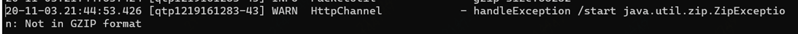

解决：执行locale可查看系统编码。创建文件/etc/sysconfig/i18n，vi写入LANG=en_US.UTF-8并保存（保证master和多台client编码相同）， 执行source /etc/sysconfig/i18n转换。


3、 数据库相关问题

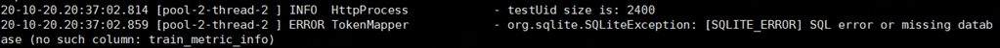

解决：大概率是数据库版本不够新，需要更新conf文件夹下的fl.db。或执行 sudo sqlite3 fl.db进入数据库，执行更新语句，最后Ctrl+D保存退出。最近更新：

（1）alter table model_table add column train_metric_info varchar(5000);

（2）alter table client_info add column dataset varchar(60) default '';

（3）CREATE TABLE inference_log (

id INTEGER PRIMARY KEY AUTOINCREMENT,

inference_id varchar(60) NOT NULL,

model_token varchar(60) NOT NULL,

task_id INTEGER NOT NULL,

username varchar(30) NOT NULL,

start_time datetime NOT NULL,

end_time datetime NOT NULL,

inference_result varchar(20) NOT NULL,

status tinyint NOT NULL DEFAULT 0 ,

created_time datetime NOT NULL DEFAULT CURRENT_TIMESTAMP ,

modified_time datetime NOT NULL DEFAULT CURRENT_TIMESTAMP

);


5、 connection refused问题

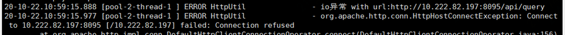

解决：网络故障或对应服务器崩了。检查网络情况，重启服务。


6、 java.lang.OutOfMemoryError: Java heap space 内存溢出问题

解决：联邦学习内存消耗较大，可以通过修改训练参数来减少内存消耗，或使用较大内存机器。


7、 启动 start.sh 时报错或失败

解决：可通过查看/export/log下的对应日志来确定失败原因。


8、配置文件修改之后未生效？

解决：每次修改完配置文件夹均需重启一下服务。


9、FederatedGB 调参，FirstRoundPredict选为"ZERO"时，需要将numBoostRound设大一些，避免所有的树都只有根节点。

10. 环境要求为Centos7，jdk1.8，若jdk版本比较高的话，可能会遇到Could not create the Java Virtual Machine的错误。

解决：更换jdk版本为jdk1.8

11. 训练特征和推理特征顺序要一致，否则会出现模型在推理数据效果变差的情况；

解决：模型上线前要确定推理数据的特征顺序与训练数据保持一致。


